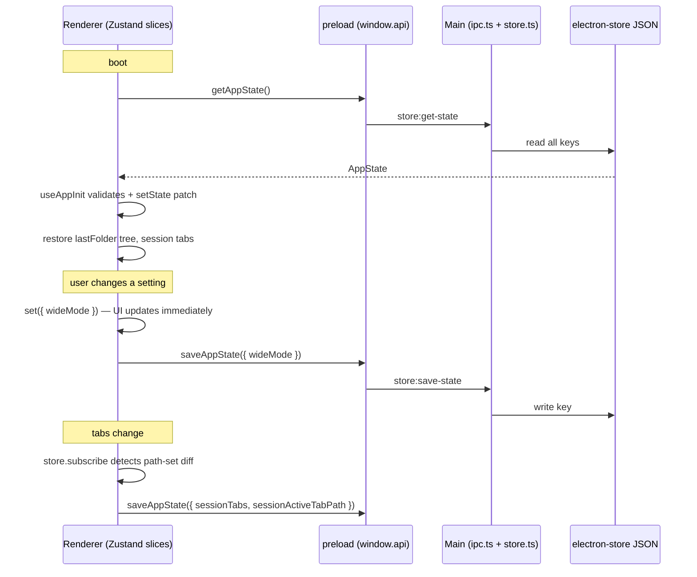

# How Mdow owns state: GPUI reader vs. Electron chrome

## Overview

Mdow ships two readers. The Electron app (`apps/desktop`) is the full product: tabs, sidebar with three modes, find-in-document, command palette, settings, session restore — all backed by Zustand slices in the renderer and `electron-store` in the main process. The GPUI app (`apps/gpui`) is a native macOS beta that renders Markdown natively (pulldown-cmark → `DocumentBlock` → GPUI elements, no webview) but has almost no chrome: one window entity, a handful of booleans, and zero persistence.

The task at hand is to give GPUI an Electron-parity chrome layer without replacing its document renderer. That means two questions matter: exactly what state the GPUI reader owns today (so the chrome layer knows what already exists and what it must add), and exactly how Electron persists its chrome (so the parity layer reproduces the right contract — what gets saved, when, and what deliberately does not).

## Key Concepts

**GPUI side** (`apps/gpui/src/`):

- `MdowApp` (`app.rs:231`) — the single window entity; the only `Render` + `Focusable` type. Everything hangs off it.
- `AppModel` (`app.rs:79`) — plain struct owned by `MdowApp`: `tabs: TabSet`, `workspace: Option<WorkspaceTree>`, `workspace_error`. All document/workspace mutation goes through its methods. Fully unit-testable without a window.
- `TabSet` / `DocumentTab` (`tabs.rs`) — ordered tabs keyed by canonicalized path; each tab holds an `Arc<PreparedDocument>`, `last_source`, and an optional `reload_error`.
- `ParsedDocument` / `PreparedDocument` — parse output (`document.rs`) and its syntax-highlighted form (`syntax.rs:139`). The rendering pipeline is `load_source` → `parse_document` → `prepare_document` → `render_document` (`ui/reader.rs`).
- Actions (`actions.rs`) — exactly six: `OpenFile`, `OpenFolder`, `ToggleSidebar`, `CloseTab`, `ToggleWideMode`, `Quit`. Bound to keys and menus in `main.rs`.

**Electron side** (`apps/desktop/src/`):

- `useAppStore` (`renderer/src/store/app-store.ts`) — one Zustand store composed of five slices: `tab-slice`, `ui-slice`, `folder-slice`, `settings-slice`, `companion-slice`.
- `electron-store` wrapper (`main/store.ts`) — the main-process persistence layer with a typed `StoreSchema` and defaults.
- IPC bridge — renderer calls `window.api.getAppState()` / `saveAppState()` / `setTheme()` etc. (`preload/index.ts`), handled in `main/ipc.ts`.
- `useAppInit` (`renderer/src/hooks/useAppInit.ts`) — the boot-time hydration hook that turns persisted state back into live store state.

## How It Works

### GPUI: one entity owns everything, nothing survives a restart

`MdowApp::new` (`app.rs:282`) constructs the entire application state: a default `AppModel`, `sidebar_open: true`, `wide_mode: false`, a `FileWatcher` with a 100 ms polling task that calls `AppModel::reload_path` for changed open files, and a theme derived from `Theme::for_appearance(window.appearance())` with a subscription that re-derives it on system appearance changes. `main.rs` opens the one window, binds the six actions to keys (`cmd-o`, `cmd-shift-o`, `cmd-b`, `cmd-w`, `cmd-shift-w`, `cmd-q`) and menus, and optionally opens a launch path.

The state splits into three tiers, all on the same entity:

1. **Document/workspace model** — `AppModel`. `open_path` routes directories to `open_workspace` (which replaces the `WorkspaceTree`) and files to `open_document` (which parses, prepares, and opens a tab). `reload_path` swaps a tab's document in place on watcher events, preserving order and selection; a failed reload keeps the last good document and sets `tab.reload_error` instead.
2. **Chrome flags** — `sidebar_open` and `wide_mode`, two bare booleans on `MdowApp`, toggled by action handlers, consumed by `ShellLayout::for_width` at render time.
3. **Reader transients** — `copied_code`, `hovered_link`, `focused_link`, `reader_scrollbar_drag`, plus per-path `HashMap`s of scroll handles and link focus handles. These are cleared by `clear_reader_transient_state` whenever the active document changes, and the per-path maps are pruned on tab close.

Nothing in `apps/gpui` is written to disk. There is no settings type, no recents list, no session save, no search state, no command palette, no overlay of any kind. Theme is `WindowAppearance`-only — there is no user light/dark/system preference. Confirming the digest: a search of the crate for "search" returns nothing; find-in-document has no hook today.

### Electron: Zustand in the renderer, electron-store in main, write-through on every change

Persistence is a round-trip across the IPC boundary. The renderer never touches disk; the main process never holds UI state.

**What is persisted.** `StoreSchema` in `main/store.ts:21` is the authoritative list: `recents` (capped at `MAX_RECENTS = 20`, pruned of paths that no longer exist on every read), `lastFolder`, `zoomLevel`, `windowBounds`, `sessionTabs` (paths only), `sessionActiveTabPath`, `contentFont`, `codeFont`, `theme`, `autoUpdateEnabled`, `wideMode`, `interfaceScale` (`compact | comfortable | large`), `readingWidth` (`standard | comfortable | wide`), `sidebarMode` (`recents | folder | outline`), and three companion keys.

**What is deliberately not persisted.** Split view, per-tab scroll positions, tab content, the render cache, the four overlay booleans, `docHeadings`/`activeHeadingId`, and — easy to miss — `sidebarOpen` itself. Only the sidebar _mode_ survives a restart; whether the sidebar is open resets to `true`.

**Settings write-through.** Each setter in `settings-slice.ts` and `ui-slice.ts` updates Zustand and fires `window.api.saveAppState({...})` with just the changed key, fire-and-forget. Theme is the exception: `setTheme` calls `window.api.setTheme(theme)` instead, and the `theme:set` handler (`ipc.ts:212`) validates against `['light', 'dark', 'system']`, sets `nativeTheme.themeSource`, persists via `saveAppState`, and repaints window chrome. So theme persistence and OS-level theme application happen atomically in main, not in the renderer.

**Session save.** Tabs are not saved by their setters. Instead `app-store.ts:43` installs a store-wide `subscribe` that serializes `{paths, activePath}` before and after each state change and calls `saveAppState({ sessionTabs, sessionActiveTabPath })` only when that key differs. Content changes and scroll changes don't trigger it; opening, closing, reordering, and activating do.

**Recents.** Recents are owned entirely by the main process: `trackRecentFile` (`ipc.ts:45`) runs inside the `file:read` and `file:open-dialog` handlers — it calls `addRecent`, registers the path with the allowed-paths sandbox, mirrors into macOS's native recent-documents menu, and rebuilds the app menu. The renderer only reads recents (`store:get-recents`). Similarly, `lastFolder` is set by the folder-open IPC handlers (`ipc.ts:139,156,185`), not by the renderer's `folder-slice`.

**Boot restore.** `useAppInit` fetches the whole `AppState`, validates every field against its allowed values before patching Zustand (a bad `sidebarMode` on disk is silently dropped), then: if an `openPath` URL param exists it opens just that; otherwise it re-reads `lastFolder`'s tree (clearing `lastFolder` on failure), restores the active session tab first for fast first paint, flips `initialized: true`, and restores the remaining tabs sequentially in the background to avoid an I/O burst. Tabs whose files vanished are skipped with a console warning.

**Overlays, search, palette.** `ui-slice.ts` holds four independent booleans: `searchOpen`, `commandPaletteOpen`, `settingsOpen`, `shortcutsDialogOpen`. Nothing prevents two being true at once — the grounding doc calls this a smell and asks the parity layer to make dual-open unrepresentable. Find-in-document (`useDocumentSearch.ts`) is pure DOM: after a 120 ms debounce it injects `<mark data-match-index>` elements into the rendered markdown container and navigates by index with `scrollIntoView`. It only runs for markdown views (`MarkdownView.tsx` gates it on `searchOpen && isActive`); HTML documents render in a fully sandboxed iframe (`HtmlView.tsx:52`, `sandbox=""`) that search cannot reach. The command palette (`CommandPalette.tsx`) is a fuzzy launcher over recents, folder-tree files, and app commands, driven entirely by the `commandPaletteOpen` boolean.

### The two apps side by side

| Concern          | Electron                                         | GPUI today                     |
| ---------------- | ------------------------------------------------ | ------------------------------ |
| Tabs             | `tab-slice` (id-keyed, split view, render cache) | `TabSet` (path-keyed, simpler) |
| Session restore  | `sessionTabs` + `useAppInit`                     | none                           |
| Settings         | `settings-slice` + write-through IPC             | none (two booleans, in-memory) |
| Sidebar          | `sidebarMode` persisted, 3 modes                 | `sidebar_open` boolean only    |
| Theme            | user preference + `nativeTheme`                  | `WindowAppearance` only        |
| Search / palette | DOM marks / `cmdk`-style overlay                 | absent                         |
| Persistence      | `electron-store` in main                         | absent                         |

## Where Things Live

- `apps/gpui/src/main.rs` — entry point, key bindings, menus, window creation
- `apps/gpui/src/app.rs` — `MdowApp`, `AppModel`, action handlers, watcher polling, render
- `apps/gpui/src/tabs.rs`, `workspace.rs`, `watcher.rs`, `theme.rs`, `actions.rs` — tab set, folder tree, file watcher, theme/metrics/layout, action declarations
- `apps/gpui/src/document.rs`, `syntax.rs`, `ui/reader.rs` — parse, highlight, render (the pipeline to leave alone)
- `apps/desktop/src/main/store.ts` — `StoreSchema`, defaults, recents cap/pruning
- `apps/desktop/src/main/ipc.ts` — all IPC handlers; recents/lastFolder/theme ownership
- `apps/desktop/src/renderer/src/store/app-store.ts` + `store/slices/` — Zustand slices and the session-save subscription
- `apps/desktop/src/renderer/src/hooks/useAppInit.ts` — boot hydration and session restore
- `apps/desktop/src/renderer/src/hooks/useDocumentSearch.ts`, `components/{SearchBar,CommandPalette,SettingsDialog,Sidebar,HtmlView}.tsx` — the chrome surfaces to reproduce

## Gotchas

- **Tab identity differs between the apps.** GPUI keys tabs by canonicalized path (`tabs.rs:126` falls back to the raw path if canonicalization fails; symlinks collapse into one tab). Electron keys tabs by generated UUID and treats path as an attribute. A parity session-restore layer persisting "tab paths" matches Electron's contract exactly — Electron saves only `{ path }` per tab.
- **Electron persists `sidebarMode` but not `sidebarOpen`.** If parity means "matches Electron," the open/closed boolean should reset on launch. Don't over-persist.
- **Theme persistence is main-owned in Electron.** The renderer never writes the `theme` key directly; `theme:set` validates, applies to `nativeTheme`, persists, and repaints chrome in one handler. GPUI currently has no preference at all — adding one means reconciling a stored `system | light | dark` value with the existing `observe_window_appearance` subscription (`app.rs:285`), and note `render` also re-derives theme every frame (`app.rs:744`).
- **The renderer's save channel is filtered.** `store:save-state` (`ipc.ts:203`) strips companion keys before calling `saveAppState`, and `saveAppState` itself only writes keys it knows. Companion settings ride a separate `getCompanionSettings`/`saveCompanionSettings` pair. Companion is out of scope for the GPUI run.
- **Reader transients are lifecycle-coupled.** `clear_reader_transient_state`, the scroll-handle map, and the link-focus reconciliation in `MdowApp` assume they are cleared/pruned on tab switch and close. Chrome code that opens or activates tabs must go through the existing `MdowApp` methods (`open_path`, `activate_tab`, `close_tab`) rather than mutating `model.tabs` directly, or these invariants break.
- **Renderer gaps the chrome layer will trip over** (all verified in `document.rs`): strikethrough parses (`ENABLE_STRIKETHROUGH` is on) but flattens to plain text via `InlineContainer::Flatten` (line 606); GFM alerts lose their kind — `Tag::BlockQuote(_)` discards it (line 489); footnote references become literal `[^label]` text (line 654) and footnote definitions leak their bodies as ordinary paragraphs (no `FootnoteDefinition` handling exists); math options are not enabled; raw HTML becomes inert `RawText`; mermaid is just a code fence (no mermaid handling anywhere in the crate).
- **`plain_text` is not what's painted.** `InlineSpan::plain_text` maps `SoftBreak` to `"\n"` (`document.rs:132`) but the painted layout renders it as a space (`ui/reader.rs:553`). Any find-in-document built on `plain_text` offsets will drift from the rendered text; search should attach to the reader's own `InlineStyleRange`/`TextRun` layout (highlight via `background_color` / `StyledText::with_highlights`), not to a separate text extraction.
- **Electron's overlay booleans are a known smell, not a spec.** The grounding doc explicitly asks the GPUI layer to model overlays as one exclusive state, not four independent flags.

## Attach points

What a chrome layer should **add or call**:

- **Call** `AppModel::{open_path, open_paths, open_document, open_workspace, reload_path}` and `MdowApp::{open_path, activate_tab, close_tab, toggle_directory, open_file_prompt, open_folder_prompt}` for all document/workspace/tab operations. Read tabs through `TabSet::{active, get, paths, len}`.
- **Add** new typed chrome state as fields beside `model` on `MdowApp` (or a dedicated struct it owns): a persisted-settings type (theme preference, fonts, interface scale, reading width, zoom, sidebar mode replacing the `sidebar_open`/`wide_mode` booleans where the spec upgrades them), an exclusive overlay enum (one `Option<Overlay>` — search / palette / settings / shortcuts — never four booleans), a recents list, and a session snapshot (tab paths + active path) saved at a persistence boundary.
- **Add** new actions to the `actions!` macro in `actions.rs` and bind them in `main.rs` alongside the existing six; wire handlers via `on_action` in `MdowApp::render` like `toggle_sidebar` does today.
- **Add** search highlighting by extending the reader's inline layout — `InlineStyleRange` / `TextRun.background_color` / `StyledText::with_highlights` in `ui/reader.rs` — and new block kinds (alerts, footnotes, mermaid cards) as `DocumentBlock` variants with parser matches and `render_block` arms.

What it must **not touch**:

- The rendering pipeline: `load_source` → `parse_document` → `prepare_document` → `render_document` stays pulldown-cmark and native GPUI. No webview, ever (Electron's sandboxed-iframe HTML path is not a license to add one).
- `TabSet` internals and the reader-transient maps (`reader_scroll_handles`, `reader_link_focus_handles`, `copied_code`, hovered/focused link) — always mutate through the existing `MdowApp` methods so cleanup invariants hold.
- The measured visual contract in `theme.rs` (`Metrics`, `ShellLayout`: sidebar 244, reader 768, Inter/Geist Mono, Electron palette) and the 132 passing tests that pin it.
- `apps/desktop` itself — Electron is the reference implementation, not a work site.
