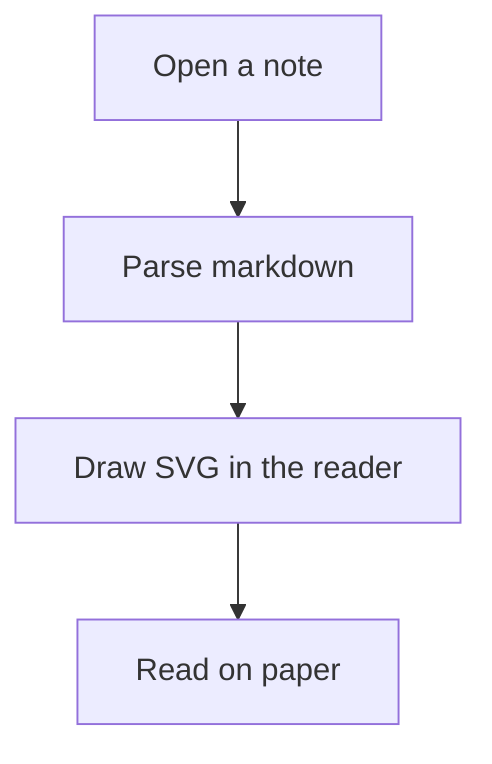
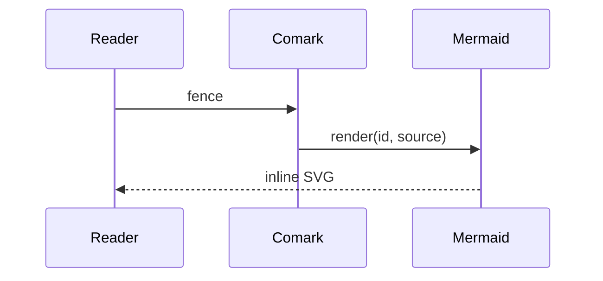
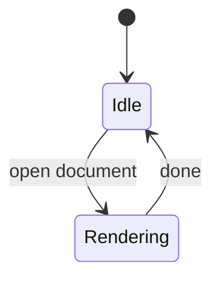

# Mermaid diagram QA

Sample document for screenshotting the in-process SVG renderer. Diagrams should read as ink on paper: paper-warm nodes, line strokes, muted edges, IBM Plex Mono labels. Teal appears only on hover or selection — never as a rainbow fill.

## Flow

## Sequence

## Across the page

## States

