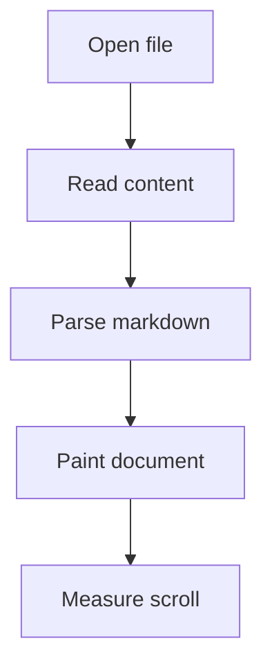
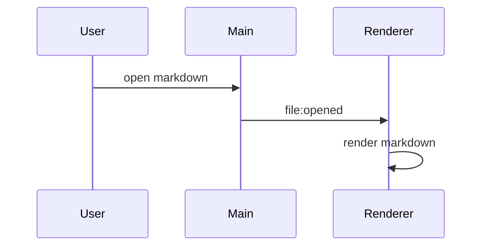

# Super Markdown Performance Fixture

This document is intentionally broad. The perf runner repeats it many times to create a large
document while preserving a realistic mix of markdown blocks.

## Prose And Emphasis

Markdown readers spend most of their time on prose, so this document includes normal paragraphs,
soft line breaks, **strong text**, _emphasis_, `inline code`, [links](https://example.com), and
punctuation-heavy copy. A realistic document also repeats similar shapes across many sections, which
is why the runner expands this fixture instead of relying on one giant hand-written file.

## Lists

- A top-level bullet with **bold** text.
- A top-level bullet with `inline code`.
- A top-level bullet with a link to [example](https://example.com).

1. Ordered item one.
2. Ordered item two.
3. Ordered item three.

## Task Lists

- [x] Parse the document.
- [x] Render highlighted code.
- [ ] Keep scrolling smooth.

## Blockquote

> Good performance means the document feels ready when the user expects it, and scrolling does not
> stall while the reader is already engaged.

## Table

| Area     | Fixture Coverage      | Expected Pressure       |
| -------- | --------------------- | ----------------------- |
| Headings | h1, h2, h3            | Outline extraction      |
| Code     | fenced blocks         | Shiki highlighting      |
| Mermaid  | diagrams              | async diagram rendering |
| Tables   | aligned columns       | nested block rendering  |
| Lists    | ordered and unordered | tree depth              |

## TypeScript Code

```ts
type PerfSample = {
  name: string
  firstContentMs: number
  scrollFrames: number
}

export function summarize(samples: PerfSample[]): number {
  return samples.reduce((sum, sample) => sum + sample.firstContentMs, 0) / samples.length
}
```

## JavaScript Code

```js
const blocks = ['heading', 'paragraph', 'code', 'table', 'diagram']
for (const block of blocks) {
  console.log(`render ${block}`)
}
```

## Bash Code

```bash
pnpm run --filter desktop test:electron:perf
```

## JSON Code

```json
{
  "fixture": "super",
  "includes": ["prose", "code", "tables", "mermaid", "lists"]
}
```

## Mermaid Flowchart



## Mermaid Sequence



## HTML-Like Text

Inline HTML-shaped text should remain readable:

`<section data-kind="fixture"><p>content</p></section>`

## Deep Nesting

- Parent
  - Child
    - Grandchild
      - Great grandchild with `code`

### Subsection With Repeated Shapes

The runner repeats this whole fixture enough times to create a large document. This gives the
Electron test a stable blend of common and expensive markdown blocks without making this source file
unpleasant to review.
