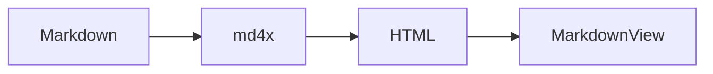

# UI showcase

Dev fixture for typography, code, tables, and diagrams.

## React component

```tsx
import { Button } from '@renderer/components/ui/button'
import { Card, CardContent, CardHeader, CardTitle } from '@renderer/components/ui/card'

export function WelcomeActions() {
  return (
    <Card size="sm">
      <CardHeader>
        <CardTitle>Open a document</CardTitle>
      </CardHeader>
      <CardContent className="flex gap-2">
        <Button variant="outline">Open File</Button>
        <Button variant="outline">Open Folder</Button>
      </CardContent>
    </Card>
  )
}
```

## Markdown mix

| Token   | Light  | Dark        |
| ------- | ------ | ----------- |
| Primary | Sky    | Sky         |
| Muted   | Mist   | Mist        |
| Border  | Subtle | Translucent |

- [x] Headings
- [x] Syntax highlighting
- [ ] Your feature here

> Blockquotes stay readable beside code and tables.


