# Diagrams and math

This fixture exercises Mermaid diagrams and TeX math in the native reader.

## Inline math

Einstein wrote $E = mc^2$, and the golden ratio is $\varphi = \frac{1 + \sqrt{5}}{2}$.
Greek letters such as $\alpha$, $\beta$ and $\Gamma$ sit on the baseline, while
$x_i^2 + y_i^2 \le r^2$ mixes subscripts and superscripts. A sum like
$\sum_{k=1}^{n} k = \frac{n(n+1)}{2}$ stays inline, and $\int_0^1 x\,dx = \tfrac{1}{2}$ too.

Prices are not math: the book costs $5 and the course costs $10, and an escaped \$ sign
stays literal. Inline display math $$a^2 + b^2 = c^2$$ renders in display style.

Math inside **strong $\lambda$ text** and a [link](#display-math) keeps working, and
`$not math$` in code stays code.

## Display math

$$
\int_{-\infty}^{\infty} e^{-x^2}\,dx = \sqrt{\pi}
$$

$$
\begin{aligned}
\nabla \cdot \mathbf{E} &= \frac{\rho}{\varepsilon_0} \\
\nabla \times \mathbf{B} &= \mu_0 \mathbf{J} + \mu_0 \varepsilon_0 \frac{\partial \mathbf{E}}{\partial t}
\end{aligned}
$$

$$
A = \begin{pmatrix} a_{11} & a_{12} & a_{13} \\ a_{21} & a_{22} & a_{23} \\ a_{31} & a_{32} & a_{33} \end{pmatrix}
\qquad
f(x) = \begin{cases} x^2 & x \ge 0 \\ -x & x < 0 \end{cases}
$$

A very wide equation scrolls horizontally instead of overflowing the column:

$$
\sum_{n=0}^{\infty} \frac{f^{(n)}(a)}{n!}(x-a)^n = f(a) + f'(a)(x-a) + \frac{f''(a)}{2!}(x-a)^2 + \frac{f'''(a)}{3!}(x-a)^3 + \frac{f^{(4)}(a)}{4!}(x-a)^4 + \cdots
$$

Broken TeX falls back to its source: $\frac{1}{$ and

$$
\left( \begin{matrix} 1 & 2 \end{matrix}
$$

## Flowchart

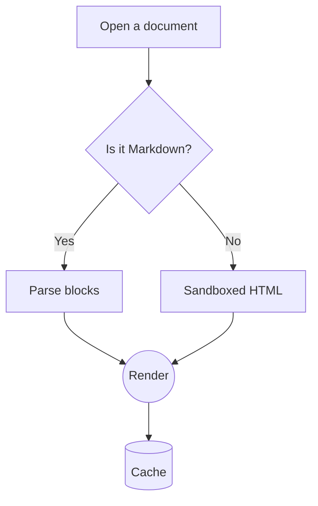

## Sequence

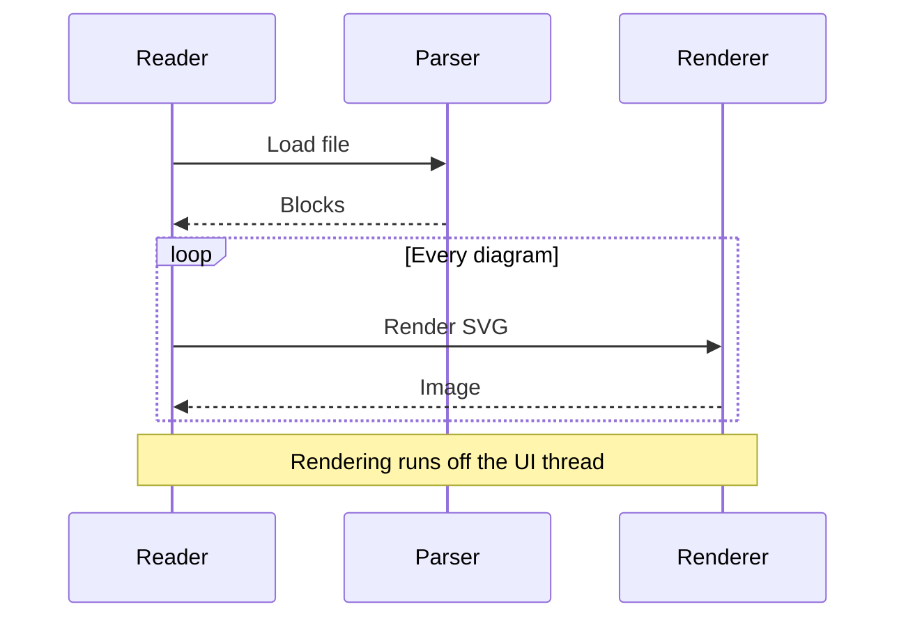

## Class

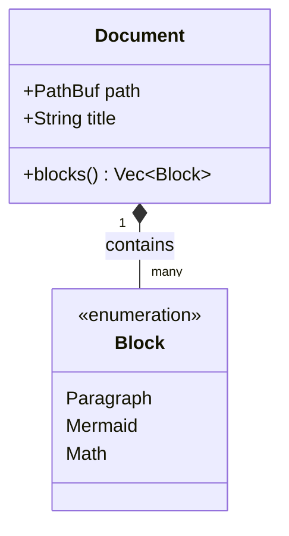

## State

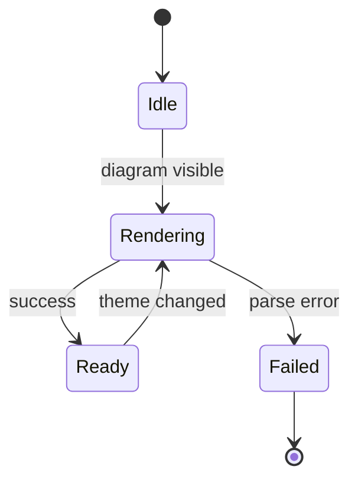

## Entity relationship

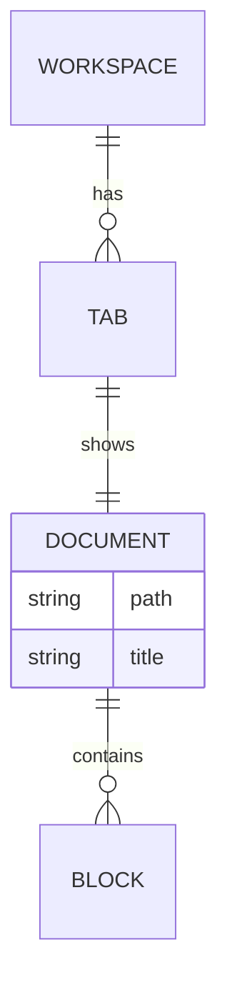

## Gantt

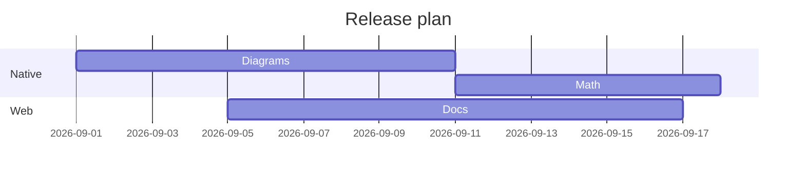

## Pie

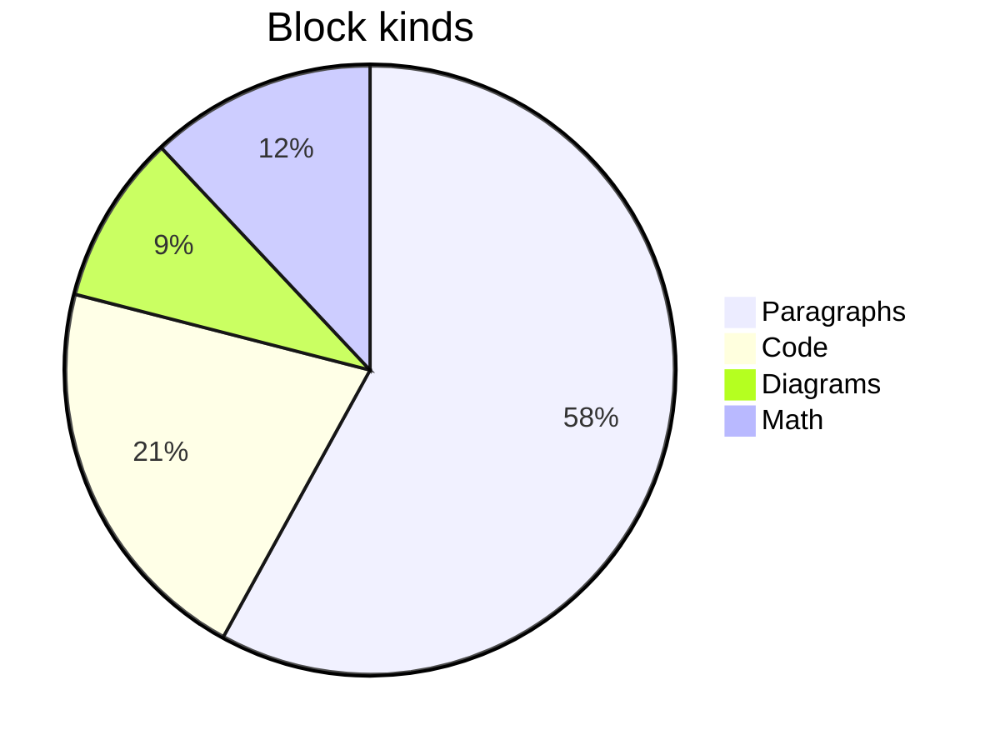

## Mindmap

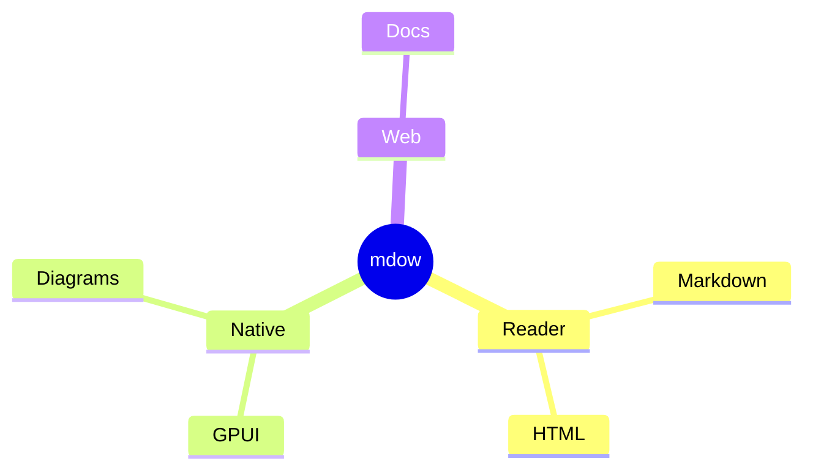

## Timeline

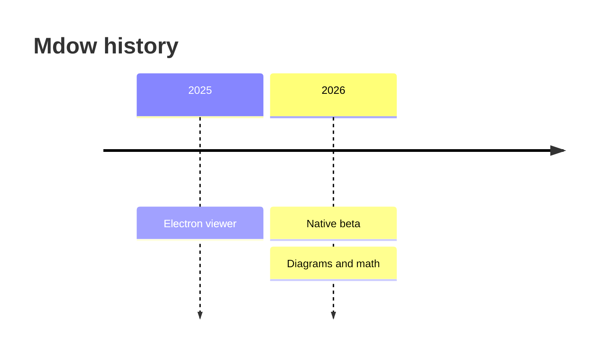

## Git graph

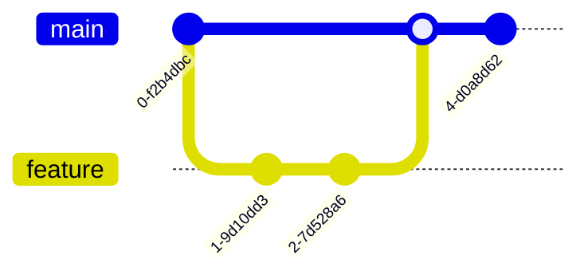

## User journey

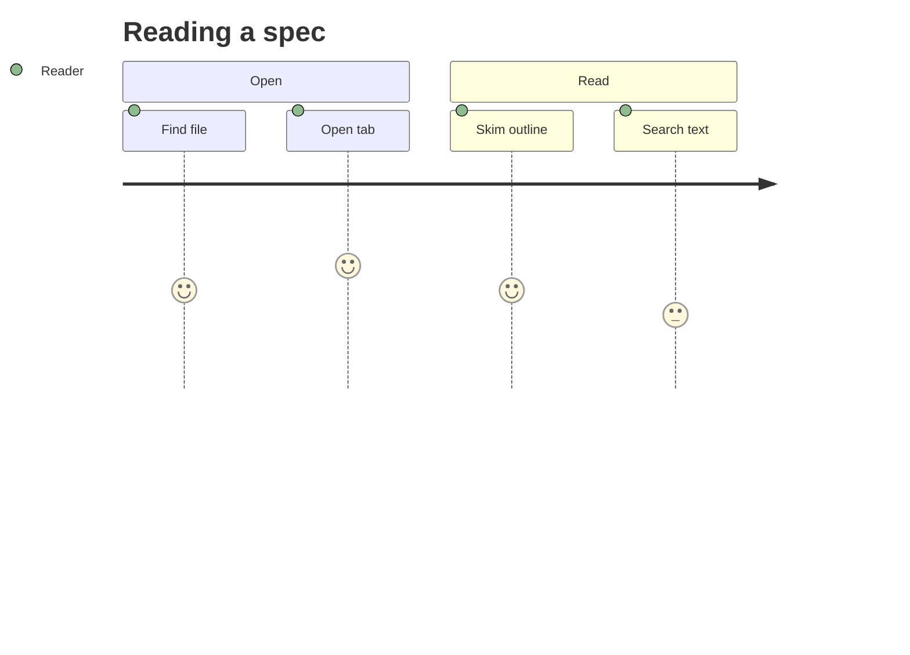

## Quadrant

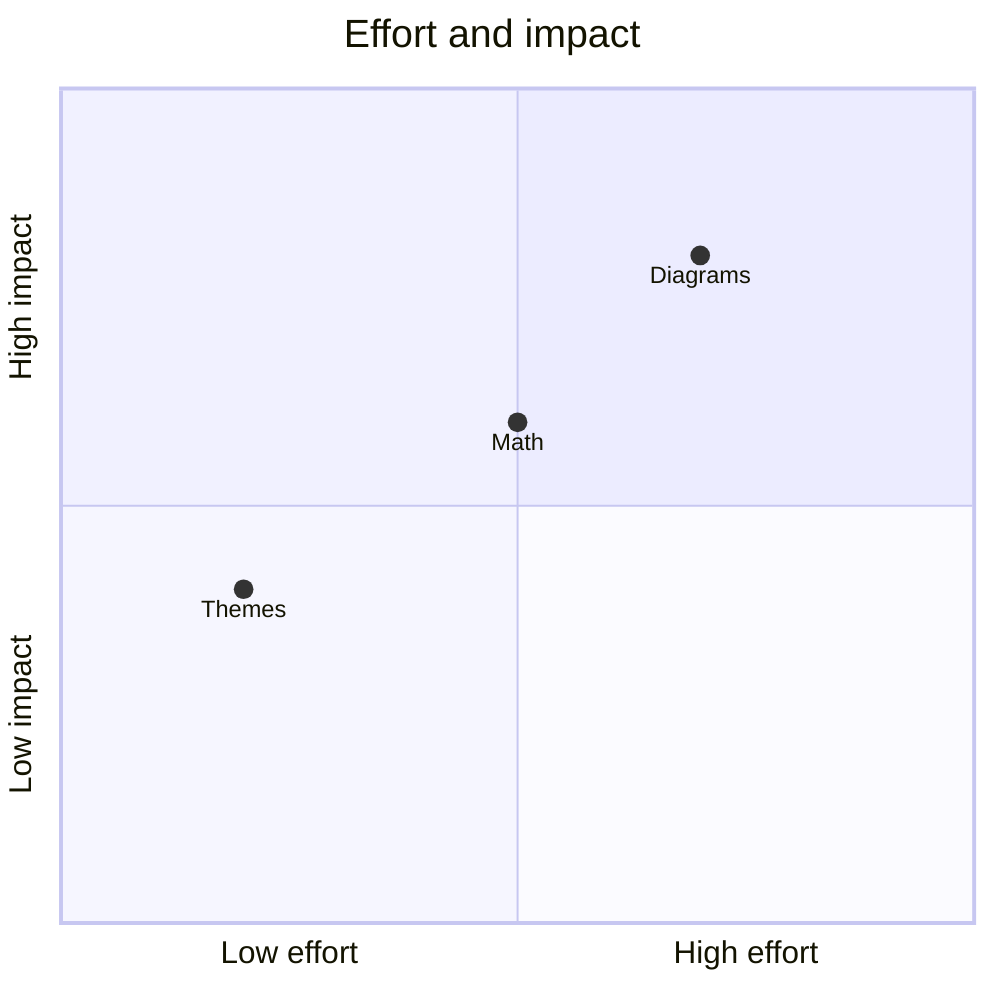

## Unsupported or invalid

```mermaid
flowchart TD
    A -->
    this is not valid mermaid ][
```
