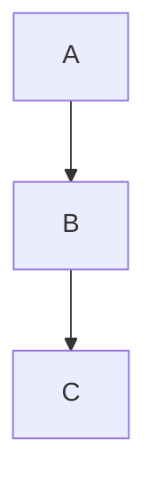

# Editing Mode Implementation Plan

> **For agentic workers:** REQUIRED SUB-SKILL: Use superpowers:subagent-driven-development (recommended) or superpowers:executing-plans to implement this plan task-by-task. Steps use checkbox (`- [ ]`) syntax for tracking.

**Goal:** Add per-tab editing mode to Mdow using Tiptap as a unified renderer for both read and edit modes, with auto-save and new-file creation.

**Architecture:** Replace the current comark renderer with a Tiptap (ProseMirror) editor. The same editor instance handles read mode (`editable: false`) and edit mode (`editable: true`), so the toggle is instant and visually seamless. Files stay plain markdown on disk via a `prosemirror-markdown` round-trip backed by passthrough nodes for constructs we can't safely tree-manipulate (frontmatter, raw HTML, Mermaid). Auto-save is a debounced write triggered by editor updates; the file watcher suppresses our own write echoes.

**Tech Stack:** Tiptap v3, prosemirror-markdown, markdown-it (already a transitive dep — installed directly), existing Shiki + Mermaid for syntax highlighting and diagrams, existing IPC/Zustand patterns.

**Reference spec:** `docs/superpowers/specs/2026-04-25-editing-mode-design.md`

**Project conventions to follow:**

- pnpm + turbo: always run via `pnpm run --filter desktop <script>`, never invoke oxlint/oxfmt/tsgo directly
- oxfmt: no semicolons, single quotes, 100-char line width, trailing commas, 2-space indent
- Tests use Vitest with jsdom + `@testing-library/react`
- Path alias `@renderer/*` → `apps/desktop/src/renderer/src/*`
- Zustand store at `store/app-store.ts`, IPC via typed handlers in `main/ipc.ts` exposed through `preload/index.ts`
- Commit per task. Use Conventional Commits: `feat(desktop):`, `refactor(desktop):`, `test(desktop):`

**Phasing:**

- **Phase 1 (Tasks 1–11):** Migrate the renderer to Tiptap as a drop-in read-only replacement for comark. Visual parity is the bar. Ship-able as its own milestone.
- **Phase 2 (Tasks 12–20):** Add editing mode, auto-save, new file flow, and update the README.

---

## File Structure (new and modified)

**New files (Phase 1):**

- `apps/desktop/src/renderer/src/lib/editor/parser.ts` — markdown → ProseMirror doc
- `apps/desktop/src/renderer/src/lib/editor/serializer.ts` — ProseMirror doc → markdown
- `apps/desktop/src/renderer/src/lib/editor/round-trip.test.ts` — fixture-based round-trip test
- `apps/desktop/src/renderer/src/lib/editor/__fixtures__/*.md` — round-trip corpus
- `apps/desktop/src/renderer/src/lib/editor/extensions/code-block-shiki.ts`
- `apps/desktop/src/renderer/src/lib/editor/extensions/mermaid-block.ts`
- `apps/desktop/src/renderer/src/lib/editor/extensions/frontmatter.ts`
- `apps/desktop/src/renderer/src/lib/editor/extensions/html-passthrough.ts`
- `apps/desktop/src/renderer/src/lib/editor/extensions/heading-ids.ts`
- `apps/desktop/src/renderer/src/lib/editor/extensions/search.ts`
- `apps/desktop/src/renderer/src/lib/editor/schema.ts` — assembled extension list
- `apps/desktop/src/renderer/src/components/Editor.tsx` — Tiptap-based view replacing MarkdownView

**Modified files (Phase 1):**

- `apps/desktop/package.json` — add Tiptap, prosemirror-markdown, markdown-it
- `apps/desktop/src/renderer/src/App.tsx` — render `<Editor>` instead of `<MarkdownView>`
- `apps/desktop/src/renderer/src/components/SearchBar.tsx` — talk to ProseMirror search ext

**Removed files (Phase 1):**

- `apps/desktop/src/renderer/src/lib/markdown.ts` (comark)
- `apps/desktop/src/renderer/src/components/MarkdownView.tsx`
- `apps/desktop/src/renderer/src/hooks/useDocumentSearch.ts`

**New / modified files (Phase 2):**

- `apps/desktop/src/main/file-service.ts` — new `writeFile`, `createFile` functions
- `apps/desktop/src/main/file-service.test.ts` — tests for the above
- `apps/desktop/src/main/ipc.ts` — wire up new IPC handlers
- `apps/desktop/src/preload/index.ts` — expose `writeFile`, `createFile` on `window.api`
- `apps/desktop/src/main/menu.ts` — add `File → New`
- `apps/desktop/src/renderer/src/store/app-store.ts` — add `mode`, `lastDiskWriteAt`, mode actions
- `apps/desktop/src/renderer/src/components/Editor.tsx` — auto-save effect, conflict banner
- `apps/desktop/src/renderer/src/components/TabBar.tsx` — pencil icon for edit-mode tabs
- `apps/desktop/src/renderer/src/components/CommandPalette.tsx` — add "Toggle edit mode", "New document"
- `README.md` — note editing capability

---

# Phase 1: Migrate renderer to Tiptap

## Task 1: Install Tiptap and supporting packages

**Files:**

- Modify: `apps/desktop/package.json`

- [ ] **Step 1: Install dependencies**

Run from repo root:

```bash
pnpm --filter desktop add @tiptap/core @tiptap/react @tiptap/pm @tiptap/starter-kit prosemirror-markdown markdown-it
pnpm --filter desktop add -D @types/markdown-it
```

- [ ] **Step 2: Verify install**

Run:

```bash
pnpm run --filter desktop typecheck
```

Expected: PASS (no usages yet, just installed deps).

- [ ] **Step 3: Commit**

```bash
git add apps/desktop/package.json pnpm-lock.yaml
git commit -m "chore(desktop): add tiptap and prosemirror-markdown deps"
```

---

## Task 2: Build the markdown parser

**Files:**

- Create: `apps/desktop/src/renderer/src/lib/editor/parser.ts`
- Create: `apps/desktop/src/renderer/src/lib/editor/parser.test.ts`

The parser converts markdown text into a ProseMirror document using `prosemirror-markdown`'s `MarkdownParser`. We start with the default schema and tokens and add custom tokens for our passthrough nodes in later tasks. For Task 2 we wire up only the basics so we have something to test.

- [ ] **Step 1: Write the failing test**

````ts
// apps/desktop/src/renderer/src/lib/editor/parser.test.ts
import { describe, it, expect } from 'vitest'
import { parseMarkdown } from './parser'

describe('parseMarkdown', () => {
  it('parses a heading', () => {
    const doc = parseMarkdown('# Hello')
    expect(doc.firstChild?.type.name).toBe('heading')
    expect(doc.firstChild?.attrs.level).toBe(1)
    expect(doc.firstChild?.textContent).toBe('Hello')
  })

  it('parses a paragraph with bold', () => {
    const doc = parseMarkdown('This is **bold** text')
    expect(doc.firstChild?.type.name).toBe('paragraph')
    expect(doc.textContent).toBe('This is bold text')
  })

  it('parses a code block', () => {
    const doc = parseMarkdown('```ts\nconst x = 1\n```')
    expect(doc.firstChild?.type.name).toBe('code_block')
    expect(doc.firstChild?.attrs.params).toBe('ts')
  })
})
````

- [ ] **Step 2: Run test to verify it fails**

Run:

```bash
pnpm run --filter desktop test -- -t parseMarkdown
```

Expected: FAIL with "Cannot find module './parser'".

- [ ] **Step 3: Write the parser**

```ts
// apps/desktop/src/renderer/src/lib/editor/parser.ts
import { defaultMarkdownParser } from 'prosemirror-markdown'
import type { Node as ProseMirrorNode } from 'prosemirror-model'

export function parseMarkdown(text: string): ProseMirrorNode {
  const doc = defaultMarkdownParser.parse(text)
  if (!doc) {
    throw new Error('Failed to parse markdown')
  }
  return doc
}
```

- [ ] **Step 4: Run test to verify it passes**

Run:

```bash
pnpm run --filter desktop test -- -t parseMarkdown
```

Expected: PASS (3 tests).

- [ ] **Step 5: Commit**

```bash
git add apps/desktop/src/renderer/src/lib/editor/parser.ts apps/desktop/src/renderer/src/lib/editor/parser.test.ts
git commit -m "feat(desktop): add markdown parser scaffold"
```

---

## Task 3: Build the markdown serializer

**Files:**

- Create: `apps/desktop/src/renderer/src/lib/editor/serializer.ts`
- Create: `apps/desktop/src/renderer/src/lib/editor/serializer.test.ts`

The serializer converts a ProseMirror document back to markdown. We use `prosemirror-markdown`'s `defaultMarkdownSerializer` for now and extend it with custom rules in later tasks.

- [ ] **Step 1: Write the failing test**

````ts
// apps/desktop/src/renderer/src/lib/editor/serializer.test.ts
import { describe, it, expect } from 'vitest'
import { parseMarkdown } from './parser'
import { serializeMarkdown } from './serializer'

describe('serializeMarkdown', () => {
  it('serializes a heading', () => {
    const doc = parseMarkdown('# Hello')
    expect(serializeMarkdown(doc)).toBe('# Hello')
  })

  it('serializes a paragraph with bold', () => {
    const doc = parseMarkdown('This is **bold** text')
    expect(serializeMarkdown(doc)).toBe('This is **bold** text')
  })

  it('serializes a code block with language', () => {
    const doc = parseMarkdown('```ts\nconst x = 1\n```')
    expect(serializeMarkdown(doc)).toBe('```ts\nconst x = 1\n```')
  })
})
````

- [ ] **Step 2: Run test to verify it fails**

Run:

```bash
pnpm run --filter desktop test -- -t serializeMarkdown
```

Expected: FAIL with "Cannot find module './serializer'".

- [ ] **Step 3: Write the serializer**

```ts
// apps/desktop/src/renderer/src/lib/editor/serializer.ts
import { defaultMarkdownSerializer } from 'prosemirror-markdown'
import type { Node as ProseMirrorNode } from 'prosemirror-model'

export function serializeMarkdown(doc: ProseMirrorNode): string {
  return defaultMarkdownSerializer.serialize(doc)
}
```

- [ ] **Step 4: Run test to verify it passes**

Run:

```bash
pnpm run --filter desktop test -- -t serializeMarkdown
```

Expected: PASS (3 tests).

- [ ] **Step 5: Commit**

```bash
git add apps/desktop/src/renderer/src/lib/editor/serializer.ts apps/desktop/src/renderer/src/lib/editor/serializer.test.ts
git commit -m "feat(desktop): add markdown serializer scaffold"
```

---

## Task 4: Build round-trip fixture corpus and CI test

**Files:**

- Create: `apps/desktop/src/renderer/src/lib/editor/__fixtures__/basic.md`
- Create: `apps/desktop/src/renderer/src/lib/editor/__fixtures__/code-blocks.md`
- Create: `apps/desktop/src/renderer/src/lib/editor/__fixtures__/lists.md`
- Create: `apps/desktop/src/renderer/src/lib/editor/__fixtures__/links-images.md`
- Create: `apps/desktop/src/renderer/src/lib/editor/round-trip.test.ts`

This is the safety net for the whole Tiptap-based renderer. Every fixture must round-trip byte-for-byte after Phase 1. Fixtures grow as we add passthrough nodes (frontmatter, mermaid, html) — Tasks 7 and 8 add fixtures for those.

- [ ] **Step 1: Write the basic fixture**

```markdown
<!-- apps/desktop/src/renderer/src/lib/editor/__fixtures__/basic.md -->

# Heading 1

## Heading 2

A paragraph with **bold** and _italic_ and `inline code`.

> A blockquote.

---

Another paragraph.
```

- [ ] **Step 2: Write the code-blocks fixture**

````markdown
<!-- apps/desktop/src/renderer/src/lib/editor/__fixtures__/code-blocks.md -->

```ts
const x: number = 1
console.log(x)
```
````

```python
def hello():
    print("hi")
```

````

- [ ] **Step 3: Write the lists fixture**

```markdown
<!-- apps/desktop/src/renderer/src/lib/editor/__fixtures__/lists.md -->
- item one
- item two
  - nested
- item three

1. first
2. second
3. third
````

- [ ] **Step 4: Write the links-images fixture**

```markdown
<!-- apps/desktop/src/renderer/src/lib/editor/__fixtures__/links-images.md -->

A [link to a page](https://example.com) and a .
```

- [ ] **Step 5: Write the failing round-trip test**

```ts
// apps/desktop/src/renderer/src/lib/editor/round-trip.test.ts
import { describe, it, expect } from 'vitest'
import { readFileSync, readdirSync } from 'node:fs'
import { join } from 'node:path'
import { parseMarkdown } from './parser'
import { serializeMarkdown } from './serializer'

const FIXTURES_DIR = join(__dirname, '__fixtures__')

describe('round-trip', () => {
  const fixtures = readdirSync(FIXTURES_DIR).filter((f) => f.endsWith('.md'))

  for (const name of fixtures) {
    it(`round-trips ${name}`, () => {
      const input = readFileSync(join(FIXTURES_DIR, name), 'utf8')
      const doc = parseMarkdown(input)
      const output = serializeMarkdown(doc)
      expect(output.trim()).toBe(input.trim())
    })
  }
})
```

The `.trim()` on both sides is intentional: prosemirror-markdown drops trailing newlines, and we don't care about trailing whitespace differences. We DO care about everything else.

- [ ] **Step 6: Run the test**

Run:

```bash
pnpm run --filter desktop test -- -t round-trip
```

Expected: most pass; some may fail for known prosemirror-markdown quirks (e.g. ordered list marker style, image alt text edge cases). For each failure, EITHER fix the fixture to match prosemirror-markdown's canonical form OR adjust the serializer in `serializer.ts` to match the source style. Document any deliberate canonicalization in a comment in the fixture.

The bar: every fixture passes after this task. If a fixture's input is "wrong" for prosemirror-markdown's defaults, normalize the fixture.

- [ ] **Step 7: Commit**

```bash
git add apps/desktop/src/renderer/src/lib/editor/__fixtures__ apps/desktop/src/renderer/src/lib/editor/round-trip.test.ts
git commit -m "test(desktop): add markdown round-trip corpus"
```

---

## Task 5: Add a code-block-shiki Tiptap extension

**Files:**

- Create: `apps/desktop/src/renderer/src/lib/editor/extensions/code-block-shiki.ts`
- Create: `apps/desktop/src/renderer/src/lib/editor/extensions/code-block-shiki.test.ts`

We replace Tiptap's default `codeBlock` with a custom node that renders with Shiki. The implementation reuses Mdow's existing Shiki language list and themes. Shiki's `codeToHtml` is async; we render via a ProseMirror node view that swaps in the highlighted HTML when ready.

- [ ] **Step 1: Write a focused test for the extension's serialization contract**

```ts
// apps/desktop/src/renderer/src/lib/editor/extensions/code-block-shiki.test.ts
import { describe, it, expect } from 'vitest'
import { Editor } from '@tiptap/core'
import { Document } from '@tiptap/extension-document'
import { Paragraph } from '@tiptap/extension-paragraph'
import { Text } from '@tiptap/extension-text'
import { CodeBlockShiki } from './code-block-shiki'

describe('CodeBlockShiki', () => {
  it('preserves the language attribute', () => {
    const editor = new Editor({
      extensions: [Document, Paragraph, Text, CodeBlockShiki],
      content: {
        type: 'doc',
        content: [
          {
            type: 'codeBlock',
            attrs: { language: 'ts' },
            content: [{ type: 'text', text: 'const x = 1' }],
          },
        ],
      },
    })
    const block = editor.state.doc.firstChild
    expect(block?.type.name).toBe('codeBlock')
    expect(block?.attrs.language).toBe('ts')
    editor.destroy()
  })
})
```

- [ ] **Step 2: Run test to verify it fails**

Run:

```bash
pnpm run --filter desktop test -- -t CodeBlockShiki
```

Expected: FAIL with "Cannot find module './code-block-shiki'".

- [ ] **Step 3: Write the extension**

```ts
// apps/desktop/src/renderer/src/lib/editor/extensions/code-block-shiki.ts
import { Node } from '@tiptap/core'
import { getHighlighter, type Highlighter } from 'shiki'

import githubLight from 'shiki/themes/github-light.mjs'
import githubDark from 'shiki/themes/github-dark.mjs'
import langJavascript from 'shiki/langs/javascript.mjs'
import langTypescript from 'shiki/langs/typescript.mjs'
import langPython from 'shiki/langs/python.mjs'
// ... copy the full lang import list from the existing markdown.ts

const LANGS = [langJavascript, langTypescript, langPython /* ... */]

let highlighterPromise: Promise<Highlighter> | null = null
function getShiki(): Promise<Highlighter> {
  if (!highlighterPromise) {
    highlighterPromise = getHighlighter({
      themes: [githubLight, githubDark],
      langs: LANGS,
    })
  }
  return highlighterPromise
}

export const CodeBlockShiki = Node.create({
  name: 'codeBlock',
  group: 'block',
  content: 'text*',
  marks: '',
  defining: true,
  code: true,
  addAttributes() {
    return {
      language: { default: null, parseHTML: (e) => e.getAttribute('data-language') },
    }
  },
  parseHTML() {
    return [{ tag: 'pre', preserveWhitespace: 'full' }]
  },
  renderHTML({ node, HTMLAttributes }) {
    return ['pre', { 'data-language': node.attrs.language ?? '', ...HTMLAttributes }, ['code', 0]]
  },
  addNodeView() {
    return ({ node }) => {
      const dom = document.createElement('pre')
      const code = document.createElement('code')
      code.textContent = node.textContent
      dom.appendChild(code)

      const language = node.attrs.language as string | null
      if (language) {
        void getShiki().then((shiki) => {
          const isDark = document.documentElement.classList.contains('dark')
          try {
            dom.outerHTML = shiki.codeToHtml(node.textContent, {
              lang: language,
              theme: isDark ? 'github-dark' : 'github-light',
            })
          } catch {
            // unknown language — leave plain
          }
        })
      }

      return { dom, contentDOM: code }
    }
  },
})
```

Note: copy the full language list from `lib/markdown.ts` — every language imported there must be imported here too. The implementer should literally copy lines 9–77 from the current `markdown.ts` and adapt them.

Also note: prosemirror-markdown calls the attribute `params`, not `language`. Add the alias in the parser/serializer adapter (Task 9 covers schema wiring).

- [ ] **Step 4: Run test to verify it passes**

Run:

```bash
pnpm run --filter desktop test -- -t CodeBlockShiki
```

Expected: PASS.

- [ ] **Step 5: Commit**

```bash
git add apps/desktop/src/renderer/src/lib/editor/extensions/code-block-shiki.ts apps/desktop/src/renderer/src/lib/editor/extensions/code-block-shiki.test.ts
git commit -m "feat(desktop): add Shiki code block Tiptap extension"
```

---

## Task 6: Add a mermaid-block Tiptap extension

**Files:**

- Create: `apps/desktop/src/renderer/src/lib/editor/extensions/mermaid-block.ts`
- Create: `apps/desktop/src/renderer/src/lib/editor/extensions/mermaid-block.test.ts`
- Create: `apps/desktop/src/renderer/src/lib/editor/__fixtures__/mermaid.md`

Mermaid blocks are atom nodes — their content is opaque source text stored as an attribute, not editable text content. In read mode they render via the existing `lib/mermaid.ts` helper. In edit mode (Phase 2) they reveal source on click; Phase 1 just renders them in read-only mode like today.

- [ ] **Step 1: Add the fixture**

````markdown
<!-- apps/desktop/src/renderer/src/lib/editor/__fixtures__/mermaid.md -->

A diagram:


````

End.

````

- [ ] **Step 2: Write the failing test**

```ts
// apps/desktop/src/renderer/src/lib/editor/extensions/mermaid-block.test.ts
import { describe, it, expect } from 'vitest'
import { parseMarkdown } from '../parser'
import { serializeMarkdown } from '../serializer'

describe('mermaid block', () => {
  it('parses ```mermaid into a mermaidBlock node', () => {
    const doc = parseMarkdown('```mermaid\ngraph TD\n  A --> B\n```')
    expect(doc.firstChild?.type.name).toBe('mermaidBlock')
    expect(doc.firstChild?.attrs.source).toBe('graph TD\n  A --> B')
  })

  it('round-trips a mermaid block', () => {
    const input = '```mermaid\ngraph TD\n  A --> B\n```'
    const doc = parseMarkdown(input)
    expect(serializeMarkdown(doc)).toBe(input)
  })
})
````

- [ ] **Step 3: Run test to verify it fails**

Run:

```bash
pnpm run --filter desktop test -- -t "mermaid block"
```

Expected: FAIL — current parser returns a `code_block` with `params: "mermaid"`, not a `mermaidBlock`.

- [ ] **Step 4: Write the extension**

```ts
// apps/desktop/src/renderer/src/lib/editor/extensions/mermaid-block.ts
import { Node } from '@tiptap/core'

export const MermaidBlock = Node.create({
  name: 'mermaidBlock',
  group: 'block',
  atom: true,
  selectable: true,
  addAttributes() {
    return {
      source: { default: '' },
    }
  },
  parseHTML() {
    return [{ tag: 'div[data-type="mermaid"]' }]
  },
  renderHTML({ HTMLAttributes }) {
    return ['div', { 'data-type': 'mermaid', ...HTMLAttributes }]
  },
  // Node view comes in Task 9 alongside the Editor component.
})
```

- [ ] **Step 5: Wire mermaid into the parser and serializer**

Modify `apps/desktop/src/renderer/src/lib/editor/parser.ts` and `serializer.ts` to special-case ` ```mermaid `:

`````ts
// parser.ts
import { schema as defaultSchema } from 'prosemirror-markdown'
import { Schema } from 'prosemirror-model'
import { MarkdownParser } from 'prosemirror-markdown'
import MarkdownIt from 'markdown-it'
import type { Node as ProseMirrorNode } from 'prosemirror-model'

export const schema = new Schema({
  nodes: defaultSchema.spec.nodes.addToEnd('mermaidBlock', {
    group: 'block',
    atom: true,
    attrs: { source: { default: '' } },
    parseDOM: [{ tag: 'div[data-type="mermaid"]' }],
    toDOM: () => ['div', { 'data-type': 'mermaid' }],
  }),
  marks: defaultSchema.spec.marks,
})

const tokenizer = MarkdownIt('commonmark', { html: true })

// `defaultMarkdownParser.tokens` is the table of token handlers prosemirror-markdown
// uses for the default schema. We import that table and reuse it; the new
// `mermaidBlock` node is populated by post-processing the parsed doc, so no
// additional token handler is needed here.
import { defaultMarkdownParser } from 'prosemirror-markdown'

const parser = new MarkdownParser(schema, tokenizer, defaultMarkdownParser.tokens)

export function parseMarkdown(text: string): ProseMirrorNode {
  const doc = parser.parse(text)
  if (!doc) throw new Error('Failed to parse markdown')
  return convertMermaidBlocks(doc)
}

// Walk the doc and replace code_block nodes whose params === 'mermaid'
// with our atom mermaidBlock nodes carrying the source as an attribute.
import { Transform } from 'prosemirror-transform'

function convertMermaidBlocks(doc: ProseMirrorNode): ProseMirrorNode {
  const replacements: { from: number; to: number; source: string }[] = []
  doc.descendants((node, pos) => {
    if (node.type.name === 'code_block' && node.attrs.params === 'mermaid') {
      replacements.push({ from: pos, to: pos + node.nodeSize, source: node.textContent })
    }
  })
  if (replacements.length === 0) return doc
  const tr = new Transform(doc)
  // Replace from end to start so earlier positions stay valid.
  for (let i = replacements.length - 1; i >= 0; i--) {
    const r = replacements[i]
    const node = schema.nodes.mermaidBlock.create({ source: r.source })
    tr.replaceWith(r.from, r.to, node)
  }
  return tr.doc
}
```

For the serializer, add a node serializer:

````ts
// serializer.ts
import { defaultMarkdownSerializer, MarkdownSerializer } from 'prosemirror-markdown'
import type { Node as ProseMirrorNode } from 'prosemirror-model'

const serializer = new MarkdownSerializer(
  {
    ...defaultMarkdownSerializer.nodes,
    mermaidBlock(state, node) {
      state.write('```mermaid\n')
      state.text(node.attrs.source as string, false)
      state.ensureNewLine()
      state.write('```')
      state.closeBlock(node)
    },
  },
  defaultMarkdownSerializer.marks,
)

export function serializeMarkdown(doc: ProseMirrorNode): string {
  return serializer.serialize(doc)
}
`````

- [ ] **Step 6: Run test to verify it passes**

Run:

```bash
pnpm run --filter desktop test -- -t "mermaid block"
pnpm run --filter desktop test -- -t round-trip
```

Expected: both pass. The `mermaid.md` fixture round-trips correctly.

- [ ] **Step 7: Commit**

```bash
git add apps/desktop/src/renderer/src/lib/editor
git commit -m "feat(desktop): add mermaid block Tiptap extension and round-trip"
```

---

## Task 7: Add frontmatter and html-passthrough extensions

**Files:**

- Create: `apps/desktop/src/renderer/src/lib/editor/extensions/frontmatter.ts`
- Create: `apps/desktop/src/renderer/src/lib/editor/extensions/html-passthrough.ts`
- Create: `apps/desktop/src/renderer/src/lib/editor/__fixtures__/frontmatter.md`
- Create: `apps/desktop/src/renderer/src/lib/editor/__fixtures__/html.md`

These two passthrough nodes use the same pattern as Mermaid: an atom node with a `source` attribute, parsed from raw text, serialized back verbatim.

- [ ] **Step 1: Add fixtures**

```markdown
## <!-- frontmatter.md -->

title: My Document
author: Zain
tags: [mdow, editing]

---

# Body content

A paragraph.
```

```markdown
<!-- html.md -->

A paragraph.

<div class="callout">
  Custom HTML content.
</div>

Another paragraph.
```

- [ ] **Step 2: Write the failing test**

```ts
// apps/desktop/src/renderer/src/lib/editor/extensions/passthrough.test.ts
import { describe, it, expect } from 'vitest'
import { parseMarkdown } from '../parser'
import { serializeMarkdown } from '../serializer'

describe('frontmatter passthrough', () => {
  it('extracts frontmatter into a frontmatter node', () => {
    const input = '---\ntitle: Hi\n---\n\n# Body'
    const doc = parseMarkdown(input)
    expect(doc.firstChild?.type.name).toBe('frontmatter')
    expect(doc.firstChild?.attrs.source).toBe('title: Hi')
  })

  it('round-trips frontmatter', () => {
    const input = '---\ntitle: Hi\n---\n\n# Body'
    expect(serializeMarkdown(parseMarkdown(input))).toBe(input)
  })
})

describe('html passthrough', () => {
  it('preserves a raw HTML block', () => {
    const input = 'Para.\n\n<div class="x">y</div>\n\nMore.'
    expect(serializeMarkdown(parseMarkdown(input))).toBe(input)
  })
})
```

- [ ] **Step 3: Run test to verify it fails**

Run:

```bash
pnpm run --filter desktop test -- -t "frontmatter passthrough"
```

Expected: FAIL.

- [ ] **Step 4: Implement the extensions and parser/serializer rules**

Add to the schema in `parser.ts`:

```ts
const schemaNodes = defaultSchema.spec.nodes
  .addToStart('frontmatter', {
    group: 'block',
    atom: true,
    attrs: { source: { default: '' } },
    parseDOM: [{ tag: 'div[data-type="frontmatter"]' }],
    toDOM: () => ['div', { 'data-type': 'frontmatter' }],
  })
  .addToEnd('mermaidBlock', {
    /* ... existing ... */
  })
  .addToEnd('htmlBlock', {
    group: 'block',
    atom: true,
    attrs: { source: { default: '' } },
    parseDOM: [{ tag: 'div[data-type="html-block"]' }],
    toDOM: () => ['div', { 'data-type': 'html-block' }],
  })
```

For frontmatter, add a pre-parse step that strips the leading `---...---` block from the input, captures its contents, and prepends a `frontmatter` node to the resulting doc:

```ts
// parser.ts
const FRONTMATTER_RE = /^---\n([\s\S]+?)\n---\n\n?/

export function parseMarkdown(text: string): ProseMirrorNode {
  let frontmatter: string | null = null
  const fm = text.match(FRONTMATTER_RE)
  if (fm) {
    frontmatter = fm[1]
    text = text.slice(fm[0].length)
  }
  const body = parser.parse(text)
  if (!body) throw new Error('Failed to parse markdown')
  let result = convertMermaidBlocks(body)
  result = convertHtmlBlocks(result)
  if (frontmatter !== null) {
    const node = schema.nodes.frontmatter.create({ source: frontmatter })
    const fragment = node.type.schema.topNodeType.createAndFill(null, [
      node,
      ...result.content.content,
    ])
    if (fragment) result = fragment
  }
  return result
}
```

For HTML blocks: prosemirror-markdown's parser, when configured with `html: true`, emits `html_block` tokens. We re-route them to our `htmlBlock` node by post-processing similar to Mermaid (find code-block-like nodes that came from html tokens, OR add a custom token handler in the parser config — choose whichever is cleaner during implementation).

Add serializer rules:

```ts
// serializer.ts (additions to the nodes object)
frontmatter(state, node) {
  state.write('---\n')
  state.text(node.attrs.source as string, false)
  state.ensureNewLine()
  state.write('---')
  state.closeBlock(node)
},
htmlBlock(state, node) {
  state.text(node.attrs.source as string, false)
  state.closeBlock(node)
},
```

- [ ] **Step 5: Run all tests**

Run:

```bash
pnpm run --filter desktop test -- -t "passthrough"
pnpm run --filter desktop test -- -t round-trip
```

Expected: all pass.

- [ ] **Step 6: Commit**

```bash
git add apps/desktop/src/renderer/src/lib/editor
git commit -m "feat(desktop): add frontmatter and html passthrough nodes"
```

---

## Task 8: Add heading-ids extension

**Files:**

- Create: `apps/desktop/src/renderer/src/lib/editor/extensions/heading-ids.ts`
- Create: `apps/desktop/src/renderer/src/lib/editor/extensions/heading-ids.test.ts`

Headings need stable `id` attributes for the breadcrumb scroll-spy. We piggyback on Tiptap's heading extension and compute IDs deterministically using the same slug algorithm as the current renderer.

- [ ] **Step 1: Write the failing test**

```ts
// apps/desktop/src/renderer/src/lib/editor/extensions/heading-ids.test.ts
import { describe, it, expect } from 'vitest'
import { slugifyHeading, dedupeSlug } from './heading-ids'

describe('heading slug helpers', () => {
  it('slugifies basic text', () => {
    expect(slugifyHeading('Hello World')).toBe('hello-world')
  })

  it('strips punctuation', () => {
    expect(slugifyHeading("What's up?")).toBe('whats-up')
  })

  it('dedupes repeated slugs', () => {
    const counts = new Map<string, number>()
    expect(dedupeSlug('intro', counts)).toBe('intro')
    expect(dedupeSlug('intro', counts)).toBe('intro-1')
    expect(dedupeSlug('intro', counts)).toBe('intro-2')
  })
})
```

- [ ] **Step 2: Run test to verify it fails**

Run:

```bash
pnpm run --filter desktop test -- -t "heading slug helpers"
```

Expected: FAIL.

- [ ] **Step 3: Write the helpers and extension**

```ts
// apps/desktop/src/renderer/src/lib/editor/extensions/heading-ids.ts
export function slugifyHeading(text: string): string {
  return text
    .toLowerCase()
    .replace(/[^a-z0-9\s-]/g, '')
    .trim()
    .replace(/\s+/g, '-')
}

export function dedupeSlug(base: string, counts: Map<string, number>): string {
  const count = counts.get(base) ?? 0
  counts.set(base, count + 1)
  return count === 0 ? base : `${base}-${count}`
}

// computeHeadingIds is called by Editor.tsx after each render to populate the doc heading store
export interface DocHeading {
  level: number
  text: string
  id: string
}

export function computeHeadingIds(rootEl: HTMLElement): DocHeading[] {
  const counts = new Map<string, number>()
  const headings: DocHeading[] = []
  const els = rootEl.querySelectorAll<HTMLElement>('h1, h2, h3, h4')
  for (const el of els) {
    const text = (el.textContent ?? '').trim()
    if (!text) continue
    const base = slugifyHeading(text)
    if (!base) continue
    const id = dedupeSlug(base, counts)
    el.id = id
    headings.push({ level: Number(el.tagName.slice(1)), text, id })
  }
  return headings
}
```

We compute IDs from the rendered DOM rather than the ProseMirror tree because the slug needs to mirror the rendered text (after marks). This matches the current behavior exactly.

- [ ] **Step 4: Run test**

Run:

```bash
pnpm run --filter desktop test -- -t "heading slug helpers"
```

Expected: PASS (3 tests).

- [ ] **Step 5: Commit**

```bash
git add apps/desktop/src/renderer/src/lib/editor/extensions/heading-ids.ts apps/desktop/src/renderer/src/lib/editor/extensions/heading-ids.test.ts
git commit -m "feat(desktop): add deterministic heading-id helpers"
```

---

## Task 9: Build the Editor component (read-only)

**Files:**

- Create: `apps/desktop/src/renderer/src/lib/editor/schema.ts`
- Create: `apps/desktop/src/renderer/src/components/Editor.tsx`
- Modify: `apps/desktop/src/renderer/src/App.tsx`

This task replaces `MarkdownView` with a Tiptap-backed `Editor` component used in read-only mode. We keep `lib/markdown.ts` and `MarkdownView.tsx` in place for now to allow side-by-side comparison; they're removed in Task 11.

- [ ] **Step 1: Build the assembled schema and extensions list**

```ts
// apps/desktop/src/renderer/src/lib/editor/schema.ts
import StarterKit from '@tiptap/starter-kit'
import { CodeBlockShiki } from './extensions/code-block-shiki'
import { MermaidBlock } from './extensions/mermaid-block'
import { Frontmatter } from './extensions/frontmatter'
import { HtmlBlockPassthrough, HtmlInlinePassthrough } from './extensions/html-passthrough'

export const editorExtensions = [
  StarterKit.configure({
    codeBlock: false, // we provide our own
  }),
  CodeBlockShiki,
  MermaidBlock,
  Frontmatter,
  HtmlBlockPassthrough,
  HtmlInlinePassthrough,
]
```

- [ ] **Step 2: Write the Editor component (read mode only)**

```tsx
// apps/desktop/src/renderer/src/components/Editor.tsx
import { useEffect, useRef } from 'react'
import { useEditor, EditorContent } from '@tiptap/react'
import { useAppStore, type Tab } from '../store/app-store'
import { editorExtensions } from '../lib/editor/schema'
import { parseMarkdown } from '../lib/editor/parser'
import { computeHeadingIds } from '../lib/editor/extensions/heading-ids'
import { initMermaid, renderMermaidBlocks, updateMermaidTheme } from '../lib/mermaid'
import { getContentFontFamily, getCodeFontFamily } from './SettingsDialog'

interface EditorProps {
  tab: Tab
}

export function Editor({ tab }: EditorProps) {
  const wideMode = useAppStore((s) => s.wideMode)
  const zoomLevel = useAppStore((s) => s.zoomLevel)
  const contentFont = useAppStore((s) => s.contentFont)
  const codeFont = useAppStore((s) => s.codeFont)
  const fontSize = useAppStore((s) => s.fontSize)
  const lineHeight = useAppStore((s) => s.lineHeight)
  const setDocHeadings = useAppStore((s) => s.setDocHeadings)
  const setActiveHeadingId = useAppStore((s) => s.setActiveHeadingId)

  const containerRef = useRef<HTMLDivElement>(null)

  const editor = useEditor(
    {
      extensions: editorExtensions,
      content: parseMarkdown(tab.content).toJSON(),
      editable: false,
    },
    [tab.id],
  )

  // When tab content changes from disk (file watcher), reload the editor.
  useEffect(() => {
    if (!editor) return
    const current = editor.getJSON()
    const next = parseMarkdown(tab.content).toJSON()
    if (JSON.stringify(current) !== JSON.stringify(next)) {
      editor.commands.setContent(next, { emitUpdate: false })
    }
  }, [editor, tab.content])

  // Compute heading IDs after render.
  useEffect(() => {
    if (!editor || !containerRef.current) return
    const headings = computeHeadingIds(containerRef.current)
    setDocHeadings(headings)
    setActiveHeadingId(headings[0]?.id ?? null)
  }, [editor, tab.content, setDocHeadings, setActiveHeadingId])

  // Initialize Mermaid once.
  useEffect(() => {
    const isDark = document.documentElement.classList.contains('dark')
    initMermaid(isDark)
  }, [])

  // Render Mermaid diagrams in node views.
  useEffect(() => {
    if (!containerRef.current) return
    const blocks: { id: string; code: string }[] = []
    const els = containerRef.current.querySelectorAll<HTMLElement>('div[data-type="mermaid"]')
    els.forEach((el, i) => {
      const id = `mermaid-${i}`
      el.id = id
      const source = el.getAttribute('data-source') ?? ''
      blocks.push({ id, code: source })
    })
    void renderMermaidBlocks(blocks)
  }, [tab.content])

  // Theme observer for Mermaid.
  useEffect(() => {
    const observer = new MutationObserver(() => {
      updateMermaidTheme(document.documentElement.classList.contains('dark'))
    })
    observer.observe(document.documentElement, { attributes: true, attributeFilter: ['class'] })
    return () => observer.disconnect()
  }, [])

  return (
    <div className="group/content relative flex-1 overflow-y-auto">
      <div
        ref={containerRef}
        className="mx-auto px-12 py-8 text-foreground markdown-body transition-[max-width] duration-200 ease-[cubic-bezier(0.23,1,0.32,1)]"
        style={
          {
            maxWidth: wideMode ? '100%' : '52rem',
            '--md-content-font': getContentFontFamily(contentFont),
            '--md-code-font': getCodeFontFamily(codeFont),
            '--md-font-size': `${fontSize * (zoomLevel / 100)}px`,
            '--md-line-height': String(lineHeight),
          } as React.CSSProperties
        }
      >
        <EditorContent editor={editor} />
      </div>
    </div>
  )
}
```

This Editor only handles read mode in this task. Search, scroll-spy IntersectionObserver, scroll position save/restore, and copy-code button get added in Tasks 9b–9c after this lands. (For brevity, those are folded into this task as separate steps below.)

- [ ] **Step 3: Add scroll-spy IntersectionObserver**

Add to `Editor.tsx` (mirrors current `MarkdownView`):

```tsx
const scrollRef = useRef<HTMLDivElement>(null)

useEffect(() => {
  const root = scrollRef.current
  const container = containerRef.current
  if (!root || !container) return
  const headingEls = container.querySelectorAll<HTMLElement>('h1[id], h2[id], h3[id], h4[id]')
  if (headingEls.length === 0) return
  const observer = new IntersectionObserver(
    (entries) => {
      const visible = entries
        .filter((e) => e.isIntersecting)
        .toSorted((a, b) => a.boundingClientRect.top - b.boundingClientRect.top)
      if (visible[0]) setActiveHeadingId(visible[0].target.id)
    },
    { root, rootMargin: '0px 0px -75% 0px', threshold: 0 },
  )
  for (const el of headingEls) observer.observe(el)
  return () => observer.disconnect()
}, [tab.content, setActiveHeadingId])
```

Wrap the outer `<div>` with `ref={scrollRef}` and remove that ref from the inner one.

- [ ] **Step 4: Add scroll position save/restore**

Copy the scroll save/restore effects from `MarkdownView.tsx:153-181` into `Editor.tsx`, adapted to use `scrollRef`.

- [ ] **Step 5: Add copy-code button click handler**

Copy `MarkdownView.tsx:109-128` into `Editor.tsx`. The handler is unchanged.

- [ ] **Step 6: Wire Editor into App.tsx behind a feature flag**

Modify `App.tsx`:

```tsx
import { Editor } from './components/Editor'
// ...keep existing MarkdownView import

const useNewEditor = true // flip to compare

const renderContent = () => {
  if (!activeTab) return <WelcomeView />
  if (activeTab.error) return <ErrorView error={activeTab.error} tabId={activeTab.id} />
  return (
    <ErrorBoundary tabId={activeTab.id}>
      {useNewEditor ? <Editor tab={activeTab} /> : <MarkdownView tab={activeTab} />}
    </ErrorBoundary>
  )
}
```

- [ ] **Step 7: Manual visual parity check**

Run:

```bash
pnpm run dev
```

Open at least 3 representative documents and visually compare against the old renderer (toggle the flag). Required parity:

- Headings, paragraphs, bold/italic/inline code render identically
- Code blocks render with Shiki and the copy button
- Mermaid diagrams render
- Scroll position persists when switching tabs
- Breadcrumb populates and updates on scroll

Document any visual deltas in the commit message. Acceptable: minor whitespace differences. Unacceptable: missing content, wrong sizes, broken Mermaid, broken Shiki.

- [ ] **Step 8: Commit**

```bash
git add apps/desktop/src/renderer/src/lib/editor/schema.ts apps/desktop/src/renderer/src/components/Editor.tsx apps/desktop/src/renderer/src/App.tsx
git commit -m "feat(desktop): add Tiptap-based Editor component (read-only, behind flag)"
```

---

## Task 10: Replace useDocumentSearch with a ProseMirror search extension

**Files:**

- Create: `apps/desktop/src/renderer/src/lib/editor/extensions/search.ts`
- Create: `apps/desktop/src/renderer/src/lib/editor/extensions/search.test.ts`
- Modify: `apps/desktop/src/renderer/src/components/Editor.tsx`
- Modify: `apps/desktop/src/renderer/src/components/SearchBar.tsx`

The current `useDocumentSearch` walks rendered HTML. We replace it with a ProseMirror plugin that decorates matching text and exposes navigation commands.

- [ ] **Step 1: Write the failing test**

```ts
// apps/desktop/src/renderer/src/lib/editor/extensions/search.test.ts
import { describe, it, expect } from 'vitest'
import { Editor } from '@tiptap/core'
import { editorExtensions } from '../schema'
import { Search } from './search'

describe('Search extension', () => {
  it('counts matches', () => {
    const editor = new Editor({
      extensions: [...editorExtensions, Search],
      content: {
        type: 'doc',
        content: [{ type: 'paragraph', content: [{ type: 'text', text: 'hello hello world' }] }],
      },
    })
    editor.commands.setSearchQuery('hello')
    expect(editor.storage.search.matchCount).toBe(2)
    editor.destroy()
  })
})
```

- [ ] **Step 2: Run test to verify it fails**

Run:

```bash
pnpm run --filter desktop test -- -t "Search extension"
```

Expected: FAIL.

- [ ] **Step 3: Implement the search extension**

```ts
// apps/desktop/src/renderer/src/lib/editor/extensions/search.ts
import { Extension } from '@tiptap/core'
import { Plugin, PluginKey } from '@tiptap/pm/state'
import { Decoration, DecorationSet } from '@tiptap/pm/view'

const searchKey = new PluginKey('search')

declare module '@tiptap/core' {
  interface Storage {
    search: { query: string; matchCount: number; currentIndex: number }
  }
  interface Commands<ReturnType> {
    search: {
      setSearchQuery: (q: string) => ReturnType
      nextMatch: () => ReturnType
      prevMatch: () => ReturnType
    }
  }
}

interface Match {
  from: number
  to: number
}

function findMatches(doc: any, query: string): Match[] {
  if (!query) return []
  const matches: Match[] = []
  const lower = query.toLowerCase()
  doc.descendants((node: any, pos: number) => {
    if (!node.isText) return
    const text = (node.text as string).toLowerCase()
    let idx = 0
    while ((idx = text.indexOf(lower, idx)) !== -1) {
      matches.push({ from: pos + idx, to: pos + idx + query.length })
      idx += query.length
    }
  })
  return matches
}

export const Search = Extension.create({
  name: 'search',
  addStorage() {
    return { query: '', matchCount: 0, currentIndex: 0 }
  },
  addCommands() {
    return {
      setSearchQuery:
        (q: string) =>
        ({ editor, tr, dispatch }) => {
          editor.storage.search.query = q
          const matches = findMatches(editor.state.doc, q)
          editor.storage.search.matchCount = matches.length
          editor.storage.search.currentIndex = matches.length > 0 ? 0 : -1
          if (dispatch) dispatch(tr.setMeta(searchKey, { matches, currentIndex: 0 }))
          return true
        },
      nextMatch:
        () =>
        ({ editor, tr, dispatch }) => {
          const count = editor.storage.search.matchCount
          if (count === 0) return false
          editor.storage.search.currentIndex = (editor.storage.search.currentIndex + 1) % count
          if (dispatch)
            dispatch(tr.setMeta(searchKey, { currentIndex: editor.storage.search.currentIndex }))
          return true
        },
      prevMatch:
        () =>
        ({ editor, tr, dispatch }) => {
          const count = editor.storage.search.matchCount
          if (count === 0) return false
          editor.storage.search.currentIndex =
            (editor.storage.search.currentIndex - 1 + count) % count
          if (dispatch)
            dispatch(tr.setMeta(searchKey, { currentIndex: editor.storage.search.currentIndex }))
          return true
        },
    }
  },
  addProseMirrorPlugins() {
    const ext = this
    return [
      new Plugin({
        key: searchKey,
        state: {
          init: () => ({ matches: [] as Match[], currentIndex: -1, decos: DecorationSet.empty }),
          apply(tr, value, oldState, newState) {
            const meta = tr.getMeta(searchKey)
            let matches = value.matches
            let currentIndex = value.currentIndex
            if (meta) {
              if (meta.matches) matches = meta.matches
              if (typeof meta.currentIndex === 'number') currentIndex = meta.currentIndex
            } else if (tr.docChanged && ext.storage.search.query) {
              matches = findMatches(newState.doc, ext.storage.search.query)
              currentIndex = matches.length > 0 ? 0 : -1
              ext.storage.search.matchCount = matches.length
              ext.storage.search.currentIndex = currentIndex
            }
            const decos = matches.map((m, i) =>
              Decoration.inline(m.from, m.to, {
                class: i === currentIndex ? 'search-match search-match-current' : 'search-match',
              }),
            )
            return { matches, currentIndex, decos: DecorationSet.create(newState.doc, decos) }
          },
        },
        props: {
          decorations(state) {
            return this.getState(state)?.decos
          },
        },
      }),
    ]
  },
})
```

The plugin's `apply` function (above) is the source of truth: it builds the `DecorationSet` from `newState.doc` whenever the doc changes or a search meta is dispatched.

- [ ] **Step 4: Add CSS for search highlights**

Modify `apps/desktop/src/renderer/src/assets/index.css` (or wherever the markdown-body styles live):

```css
.search-match {
  background-color: rgb(254 240 138 / 0.7); /* yellow-200 */
}
.search-match-current {
  background-color: rgb(250 204 21 / 0.9); /* yellow-400 */
}
```

- [ ] **Step 5: Wire SearchBar to the editor**

Replace the `useDocumentSearch` hook usage in `Editor.tsx` with reads from `editor.storage.search`. Modify `SearchBar.tsx` to call `editor.commands.setSearchQuery(...)`, `editor.commands.nextMatch()`, etc.

The Editor component owns the editor instance, so it passes the search interface down to `SearchBar` (or reads from `editor.storage.search` directly and forwards to SearchBar via props).

- [ ] **Step 6: Run tests**

Run:

```bash
pnpm run --filter desktop test -- -t "Search extension"
pnpm run --filter desktop test
```

Expected: PASS.

- [ ] **Step 7: Manual test**

In dev mode: open a doc, press `Cmd+F`, type a query, verify highlights, navigate with arrows.

- [ ] **Step 8: Commit**

```bash
git add apps/desktop/src/renderer/src/lib/editor/extensions/search.ts apps/desktop/src/renderer/src/lib/editor/extensions/search.test.ts apps/desktop/src/renderer/src/components/Editor.tsx apps/desktop/src/renderer/src/components/SearchBar.tsx apps/desktop/src/renderer/src/assets
git commit -m "feat(desktop): replace useDocumentSearch with ProseMirror search plugin"
```

---

## Task 11: Remove comark and the old renderer

**Files:**

- Modify: `apps/desktop/src/renderer/src/App.tsx` (remove flag)
- Delete: `apps/desktop/src/renderer/src/lib/markdown.ts`
- Delete: `apps/desktop/src/renderer/src/components/MarkdownView.tsx`
- Delete: `apps/desktop/src/renderer/src/hooks/useDocumentSearch.ts`
- Modify: `apps/desktop/package.json` (remove comark, @comark/html)

This removes the parallel renderer once Editor has full parity.

- [ ] **Step 1: Remove the feature flag and the MarkdownView import**

Modify `App.tsx`: drop `import { MarkdownView }`, simplify `renderContent` to always use `<Editor>`.

- [ ] **Step 2: Delete files**

```bash
rm apps/desktop/src/renderer/src/lib/markdown.ts
rm apps/desktop/src/renderer/src/components/MarkdownView.tsx
rm apps/desktop/src/renderer/src/hooks/useDocumentSearch.ts
```

- [ ] **Step 3: Remove comark deps**

```bash
pnpm --filter desktop remove comark @comark/html
```

- [ ] **Step 4: Verify**

Run:

```bash
pnpm run --filter desktop typecheck
pnpm run --filter desktop test
pnpm run --filter desktop lint
```

Expected: all pass. If any test or lint references the deleted files, fix the reference.

- [ ] **Step 5: Manual smoke test**

```bash
pnpm run dev
```

Open a few docs end-to-end. Sanity-check Mermaid, code blocks, search, scroll-spy, breadcrumb.

- [ ] **Step 6: Commit**

```bash
git add -A
git commit -m "refactor(desktop): remove comark renderer in favor of Tiptap"
```

---

# Phase 2: Add editing mode

## Task 12: Add writeFile IPC

**Files:**

- Modify: `apps/desktop/src/main/file-service.ts`
- Modify: `apps/desktop/src/main/file-service.test.ts`
- Modify: `apps/desktop/src/main/ipc.ts`
- Modify: `apps/desktop/src/preload/index.ts`

- [ ] **Step 1: Write the failing test for writeFile in file-service**

```ts
// add to file-service.test.ts
import { describe, it, expect } from 'vitest'
import { writeFile } from './file-service'
import { mkdtempSync, readFileSync, rmSync } from 'node:fs'
import { tmpdir } from 'node:os'
import { join } from 'node:path'

describe('writeFile', () => {
  it('writes utf-8 content to disk', async () => {
    const dir = mkdtempSync(join(tmpdir(), 'mdow-test-'))
    const path = join(dir, 'a.md')
    await writeFile(path, '# Hello\n')
    expect(readFileSync(path, 'utf8')).toBe('# Hello\n')
    rmSync(dir, { recursive: true })
  })
})
```

- [ ] **Step 2: Run test to verify it fails**

Run:

```bash
pnpm run --filter desktop test -- -t writeFile
```

Expected: FAIL with "writeFile is not exported".

- [ ] **Step 3: Implement writeFile**

Add to `file-service.ts`:

```ts
import { writeFile as fsWriteFile } from 'node:fs/promises'

export async function writeFile(path: string, content: string): Promise<void> {
  await fsWriteFile(path, content, 'utf8')
}
```

- [ ] **Step 4: Wire IPC**

In `main/ipc.ts`:

```ts
ipcMain.handle('writeFile', async (_, path: string, content: string) => {
  await writeFile(path, content)
})
```

In `preload/index.ts`:

```ts
writeFile: (path: string, content: string): Promise<void> =>
  ipcRenderer.invoke('writeFile', path, content),
```

And update `Window.api` types in `preload/index.d.ts` to include `writeFile`.

- [ ] **Step 5: Run tests**

Run:

```bash
pnpm run --filter desktop test
pnpm run --filter desktop typecheck
```

Expected: PASS.

- [ ] **Step 6: Commit**

```bash
git add apps/desktop/src/main apps/desktop/src/preload
git commit -m "feat(desktop): add writeFile IPC handler"
```

---

## Task 13: Add per-tab mode state

**Files:**

- Modify: `apps/desktop/src/renderer/src/store/app-store.ts`
- Modify: `apps/desktop/src/renderer/src/store/app-store.test.ts`

- [ ] **Step 1: Write failing tests**

```ts
// add to app-store.test.ts
import { describe, it, expect } from 'vitest'
import { useAppStore } from './app-store'

describe('tab mode', () => {
  it('new tabs default to read mode', () => {
    useAppStore.getState().openTab({ path: '/x.md', content: 'a' })
    const tab = useAppStore.getState().tabs[0]
    expect(tab.mode).toBe('read')
  })

  it('toggleTabMode flips mode', () => {
    useAppStore.setState({ tabs: [], activeTabId: null })
    useAppStore.getState().openTab({ path: '/y.md', content: 'a' })
    const id = useAppStore.getState().tabs[0].id
    useAppStore.getState().toggleTabMode(id)
    expect(useAppStore.getState().tabs[0].mode).toBe('edit')
    useAppStore.getState().toggleTabMode(id)
    expect(useAppStore.getState().tabs[0].mode).toBe('read')
  })
})
```

- [ ] **Step 2: Run tests to verify failure**

Run:

```bash
pnpm run --filter desktop test -- -t "tab mode"
```

Expected: FAIL.

- [ ] **Step 3: Add mode state and actions**

Modify `app-store.ts`:

```ts
export interface Tab {
  id: string
  path: string
  content: string
  scrollPosition: number
  mode: 'read' | 'edit'
  lastDiskWriteAt?: number
  error?: FileError | null
}

interface AppStore {
  // ...existing
  toggleTabMode: (tabId: string) => void
  setTabMode: (tabId: string, mode: 'read' | 'edit') => void
  markTabWritten: (path: string, timestamp: number) => void
}

// In create():
openTab: (file) =>
  set((state) => {
    // ...existing logic, but newTab includes mode: 'read'
    const newTab: Tab = {
      id: crypto.randomUUID(),
      path: file.path,
      content: file.content,
      scrollPosition: 0,
      mode: 'read',
    }
    // ...
  }),

toggleTabMode: (tabId) =>
  set((state) => ({
    tabs: state.tabs.map((t) =>
      t.id === tabId ? { ...t, mode: t.mode === 'read' ? 'edit' : 'read' } : t,
    ),
  })),

setTabMode: (tabId, mode) =>
  set((state) => ({
    tabs: state.tabs.map((t) => (t.id === tabId ? { ...t, mode } : t)),
  })),

markTabWritten: (path, timestamp) =>
  set((state) => ({
    tabs: state.tabs.map((t) => (t.path === path ? { ...t, lastDiskWriteAt: timestamp } : t)),
  })),
```

- [ ] **Step 4: Run tests**

Run:

```bash
pnpm run --filter desktop test
pnpm run --filter desktop typecheck
```

Expected: PASS. (Some existing tests may need updating to include `mode` in expected tab shape.)

- [ ] **Step 5: Commit**

```bash
git add apps/desktop/src/renderer/src/store
git commit -m "feat(desktop): add per-tab edit mode state to app-store"
```

---

## Task 14: Wire Cmd+E mode toggle and tab UI indicator

**Files:**

- Modify: `apps/desktop/src/renderer/src/App.tsx`
- Modify: `apps/desktop/src/renderer/src/components/Editor.tsx`
- Modify: `apps/desktop/src/renderer/src/components/TabBar.tsx`

- [ ] **Step 1: Add Cmd+E handler in App.tsx**

In the keydown handler in `App.tsx`, add:

```ts
if (mod && e.key === 'e') {
  e.preventDefault()
  const state = useAppStore.getState()
  if (state.activeTabId) state.toggleTabMode(state.activeTabId)
}
```

- [ ] **Step 2: Wire `editable` to tab.mode in Editor.tsx**

```tsx
const editor = useEditor(
  {
    extensions: editorExtensions,
    content: parseMarkdown(tab.content).toJSON(),
    editable: tab.mode === 'edit',
  },
  [tab.id],
)

useEffect(() => {
  if (editor) editor.setEditable(tab.mode === 'edit')
}, [editor, tab.mode])
```

- [ ] **Step 3: Add pencil indicator to tab in TabBar.tsx**

Find the tab title rendering in `TabBar.tsx` and conditionally show a small pencil icon (lucide-react `Pencil` is already used in shadcn/ui setups; `import { Pencil } from 'lucide-react'`):

```tsx
{
  tab.mode === 'edit' && <Pencil className="h-3 w-3 opacity-60" />
}
```

- [ ] **Step 4: Manual test**

Run:

```bash
pnpm run dev
```

Open a doc, press `Cmd+E`, see the pencil appear, see the document become editable (typing changes content). Press `Cmd+E` again, see it return to read mode.

- [ ] **Step 5: Commit**

```bash
git add apps/desktop/src/renderer/src/App.tsx apps/desktop/src/renderer/src/components/Editor.tsx apps/desktop/src/renderer/src/components/TabBar.tsx
git commit -m "feat(desktop): wire Cmd+E to toggle per-tab edit mode"
```

---

## Task 15: Auto-save with debounce and watcher echo suppression

**Files:**

- Modify: `apps/desktop/src/renderer/src/components/Editor.tsx`
- Modify: `apps/desktop/src/renderer/src/App.tsx`

- [ ] **Step 1: Add auto-save effect to Editor.tsx**

```tsx
import { serializeMarkdown } from '../lib/editor/serializer'

// Inside Editor component:
const markTabWritten = useAppStore((s) => s.markTabWritten)

useEffect(() => {
  if (!editor) return
  let timer: ReturnType<typeof setTimeout> | undefined
  const handler = () => {
    if (timer) clearTimeout(timer)
    timer = setTimeout(async () => {
      const markdown = serializeMarkdown(editor.state.doc)
      if (markdown === tab.content) return
      try {
        await window.api.writeFile(tab.path, markdown)
        markTabWritten(tab.path, Date.now())
      } catch (err) {
        console.error('Auto-save failed:', err)
        // Banner is added in Task 16.
      }
    }, 500)
  }
  editor.on('update', handler)
  return () => {
    editor.off('update', handler)
    if (timer) clearTimeout(timer)
  }
}, [editor, tab.path, tab.content, markTabWritten])
```

- [ ] **Step 2: Suppress watcher echo in App.tsx**

Update the `onFileChanged` handler:

```ts
window.api.onFileChanged((data) => {
  const tabs = useAppStore.getState().tabs
  const tab = tabs.find((t) => t.path === data.path)
  if (tab?.lastDiskWriteAt && Date.now() - tab.lastDiskWriteAt < 1000) {
    // Our own echo — ignore.
    return
  }
  updateTabContent(data.path, data.content)
}),
```

- [ ] **Step 3: Manual test**

Run:

```bash
pnpm run dev
```

Open a doc in a folder you control. Toggle edit mode. Type. Watch the file on disk update ~500ms after you stop typing (use `tail -f file.md` in another terminal or check the modified time). Toggle back to read mode — content stays. Switch tabs and back — content persists.

- [ ] **Step 4: Commit**

```bash
git add apps/desktop/src/renderer/src/components/Editor.tsx apps/desktop/src/renderer/src/App.tsx
git commit -m "feat(desktop): auto-save edits with debounced writes"
```

---

## Task 16: External-change conflict banner

**Files:**

- Create: `apps/desktop/src/renderer/src/components/ConflictBanner.tsx`
- Modify: `apps/desktop/src/renderer/src/components/Editor.tsx`
- Modify: `apps/desktop/src/renderer/src/store/app-store.ts`
- Modify: `apps/desktop/src/renderer/src/App.tsx`

When a file changes on disk while in edit mode and the disk content differs from the editor's current content, show a banner.

- [ ] **Step 1: Add conflict state to the store**

```ts
// app-store.ts additions
interface AppStore {
  // ...
  tabConflicts: Record<string, string> // tabId -> disk content awaiting resolution
  setTabConflict: (tabId: string, diskContent: string | null) => void
}

setTabConflict: (tabId, diskContent) =>
  set((state) => {
    const next = { ...state.tabConflicts }
    if (diskContent === null) delete next[tabId]
    else next[tabId] = diskContent
    return { tabConflicts: next }
  }),
```

Initialize `tabConflicts: {}`.

- [ ] **Step 2: Detect conflicts in App.tsx onFileChanged**

```ts
window.api.onFileChanged((data) => {
  const state = useAppStore.getState()
  const tab = state.tabs.find((t) => t.path === data.path)
  if (!tab) return
  if (tab.lastDiskWriteAt && Date.now() - tab.lastDiskWriteAt < 1000) return
  if (tab.mode === 'read') {
    updateTabContent(data.path, data.content)
    return
  }
  // Edit mode: only conflict if disk content differs from current editor content.
  if (data.content === tab.content) return
  state.setTabConflict(tab.id, data.content)
}),
```

- [ ] **Step 3: Build the banner component**

```tsx
// apps/desktop/src/renderer/src/components/ConflictBanner.tsx
import { Button } from './ui/button'
import { useAppStore } from '../store/app-store'

interface ConflictBannerProps {
  tabId: string
  diskContent: string
}

export function ConflictBanner({ tabId, diskContent }: ConflictBannerProps) {
  const updateTabContent = useAppStore((s) => s.updateTabContent)
  const setTabConflict = useAppStore((s) => s.setTabConflict)
  const tab = useAppStore((s) => s.tabs.find((t) => t.id === tabId))

  if (!tab) return null

  const reload = () => {
    updateTabContent(tab.path, diskContent)
    setTabConflict(tabId, null)
  }
  const keep = () => {
    setTabConflict(tabId, null)
    // Trigger a write by leaving content as-is — Editor's auto-save will
    // pick up the next edit and overwrite. To proactively persist now,
    // call window.api.writeFile here.
    void window.api.writeFile(tab.path, tab.content)
  }

  return (
    <div className="border-b bg-yellow-50 dark:bg-yellow-900/20 px-4 py-2 text-sm flex items-center justify-between">
      <span>This file was changed on disk.</span>
      <div className="flex gap-2">
        <Button size="sm" variant="ghost" onClick={keep}>
          Keep my version
        </Button>
        <Button size="sm" onClick={reload}>
          Reload
        </Button>
      </div>
    </div>
  )
}
```

- [ ] **Step 4: Render the banner inside Editor.tsx**

```tsx
const conflict = useAppStore((s) => s.tabConflicts[tab.id])

return (
  <div ref={scrollRef} className="...">
    {conflict !== undefined && <ConflictBanner tabId={tab.id} diskContent={conflict} />}
    {/* ...existing content... */}
  </div>
)
```

- [ ] **Step 5: Manual test**

Run dev. Open a file in edit mode, type some changes. In another terminal, edit the same file with `echo`. The banner should appear. Click Reload — your changes are replaced with disk. Repeat, click Keep — your version persists, disk gets overwritten on next auto-save tick.

- [ ] **Step 6: Commit**

```bash
git add apps/desktop/src/renderer/src/components/ConflictBanner.tsx apps/desktop/src/renderer/src/components/Editor.tsx apps/desktop/src/renderer/src/store/app-store.ts apps/desktop/src/renderer/src/App.tsx
git commit -m "feat(desktop): add external-change conflict banner for edit mode"
```

---

## Task 17: Add createFile IPC

**Files:**

- Modify: `apps/desktop/src/main/file-service.ts`
- Modify: `apps/desktop/src/main/file-service.test.ts`
- Modify: `apps/desktop/src/main/ipc.ts`
- Modify: `apps/desktop/src/preload/index.ts`

- [ ] **Step 1: Write failing tests**

```ts
// add to file-service.test.ts
import { createFileInFolder, generateUniqueName } from './file-service'

describe('generateUniqueName', () => {
  it('returns base name when not taken', () => {
    expect(generateUniqueName(['a.md', 'b.md'], 'Untitled.md')).toBe('Untitled.md')
  })
  it('numbers when taken', () => {
    expect(generateUniqueName(['Untitled.md'], 'Untitled.md')).toBe('Untitled-2.md')
    expect(generateUniqueName(['Untitled.md', 'Untitled-2.md'], 'Untitled.md')).toBe(
      'Untitled-3.md',
    )
  })
})

describe('createFileInFolder', () => {
  it('creates an empty markdown file with a unique name', async () => {
    const dir = mkdtempSync(join(tmpdir(), 'mdow-test-'))
    const result = await createFileInFolder(dir)
    expect(result.path).toBe(join(dir, 'Untitled.md'))
    expect(readFileSync(result.path, 'utf8')).toBe('')
    const result2 = await createFileInFolder(dir)
    expect(result2.path).toBe(join(dir, 'Untitled-2.md'))
    rmSync(dir, { recursive: true })
  })
})
```

- [ ] **Step 2: Run tests to verify failure**

```bash
pnpm run --filter desktop test -- -t "createFileInFolder"
```

Expected: FAIL.

- [ ] **Step 3: Implement**

```ts
// file-service.ts
import { readdir, writeFile as fsWriteFile } from 'node:fs/promises'
import { join } from 'node:path'

export function generateUniqueName(existing: string[], base: string): string {
  if (!existing.includes(base)) return base
  const dot = base.lastIndexOf('.')
  const stem = dot > 0 ? base.slice(0, dot) : base
  const ext = dot > 0 ? base.slice(dot) : ''
  let n = 2
  while (existing.includes(`${stem}-${n}${ext}`)) n++
  return `${stem}-${n}${ext}`
}

export async function createFileInFolder(folderPath: string): Promise<{ path: string }> {
  const entries = await readdir(folderPath)
  const name = generateUniqueName(entries, 'Untitled.md')
  const path = join(folderPath, name)
  await fsWriteFile(path, '', 'utf8')
  return { path }
}
```

- [ ] **Step 4: Wire IPC for createFile**

In `main/ipc.ts`:

```ts
ipcMain.handle('createFile', async (_, folderPath: string | null) => {
  if (folderPath) {
    return await createFileInFolder(folderPath)
  }
  const result = await dialog.showSaveDialog({
    defaultPath: 'Untitled.md',
    filters: [{ name: 'Markdown', extensions: ['md', 'markdown', 'mdx'] }],
  })
  if (result.canceled || !result.filePath) return null
  await fsWriteFile(result.filePath, '', 'utf8')
  return { path: result.filePath }
})
```

In `preload/index.ts`:

```ts
createFile: (folderPath: string | null): Promise<{ path: string } | null> =>
  ipcRenderer.invoke('createFile', folderPath),
```

Update `Window.api` types.

- [ ] **Step 5: Run tests**

```bash
pnpm run --filter desktop test
pnpm run --filter desktop typecheck
```

Expected: PASS.

- [ ] **Step 6: Commit**

```bash
git add apps/desktop/src/main apps/desktop/src/preload
git commit -m "feat(desktop): add createFile IPC for new document creation"
```

---

## Task 18: Cmd+N new file flow + menu + command palette

**Files:**

- Modify: `apps/desktop/src/renderer/src/App.tsx`
- Modify: `apps/desktop/src/main/menu.ts`
- Modify: `apps/desktop/src/renderer/src/components/CommandPalette.tsx`
- Modify: `apps/desktop/src/preload/index.ts` (if menu event piping needed)

- [ ] **Step 1: Add Cmd+N handler in App.tsx**

```ts
if (mod && e.key === 'n' && !e.shiftKey) {
  e.preventDefault()
  void createNewFile()
}
```

Define `createNewFile` once near the other handlers:

```ts
const createNewFile = useCallback(async () => {
  const folderPath = useAppStore.getState().openFolderPath
  const result = await window.api.createFile(folderPath)
  if (!result) return
  openTab({ path: result.path, content: '' })
  useAppStore.getState().setTabMode(useAppStore.getState().activeTabId!, 'edit')
  void queryClient.invalidateQueries({ queryKey: ['recents'] })
}, [openTab, queryClient])
```

- [ ] **Step 2: Add File → New menu item**

Modify `main/menu.ts` File submenu:

```ts
{
  label: 'New',
  accelerator: 'CmdOrCtrl+N',
  click: () => mainWindow?.webContents.send('menu:new-file'),
},
```

Wire `onMenuNewFile` in preload and listen in App.tsx:

```ts
window.api.onMenuNewFile(() => void createNewFile()),
```

- [ ] **Step 3: Add command palette entry**

In `CommandPalette.tsx`, add a command:

```ts
{ id: 'new-document', label: 'New document', shortcut: 'Cmd+N', action: () => void createNewFile() },
{ id: 'toggle-edit', label: 'Toggle edit mode', shortcut: 'Cmd+E', action: () => {
    const id = useAppStore.getState().activeTabId
    if (id) useAppStore.getState().toggleTabMode(id)
}},
```

(Adapt to the actual command palette command shape used in the file.)

- [ ] **Step 4: Manual test**

Run dev. Press `Cmd+N` with a folder open → `Untitled.md` appears in the folder, opens in edit mode. Press `Cmd+N` again → `Untitled-2.md`. Close the folder, press `Cmd+N` → save dialog. Use the command palette to test those entries too. Use the menu File → New.

- [ ] **Step 5: Commit**

```bash
git add apps/desktop/src/renderer apps/desktop/src/main apps/desktop/src/preload
git commit -m "feat(desktop): add Cmd+N to create new markdown documents"
```

---

## Task 19: Failure mode for unsupported markdown

**Files:**

- Modify: `apps/desktop/src/renderer/src/lib/editor/parser.ts`
- Modify: `apps/desktop/src/renderer/src/components/Editor.tsx`
- Modify: `apps/desktop/src/renderer/src/components/TabBar.tsx`

If parsing fails or produces a doc that round-trips lossy, disable edit mode for that tab with a tooltip.

- [ ] **Step 1: Expose a parse-with-result helper**

```ts
// parser.ts
export interface ParseResult {
  doc: ProseMirrorNode
  lossy: boolean
}

export function parseMarkdownChecked(text: string): ParseResult {
  const doc = parseMarkdown(text)
  let lossy = false
  try {
    const out = serializeMarkdown(doc)
    lossy = out.trim() !== text.trim()
  } catch {
    lossy = true
  }
  return { doc, lossy }
}
```

- [ ] **Step 2: Use it in Editor.tsx**

Replace `parseMarkdown(tab.content)` calls with `parseMarkdownChecked(tab.content).doc` and store `lossy` on the tab via a new store field `lossyTabs: Set<string>` or a per-tab `editable: boolean` field.

For simplicity: add `editableSafe: boolean` to `Tab` (default true; set false on parse if lossy detected on first load).

- [ ] **Step 3: Block toggle in App.tsx**

```ts
if (mod && e.key === 'e') {
  e.preventDefault()
  const state = useAppStore.getState()
  const tab = state.tabs.find((t) => t.id === state.activeTabId)
  if (!tab) return
  if (tab.editableSafe === false) {
    // Show a transient toast — for v1 a console.warn + native menu hint is fine
    return
  }
  state.toggleTabMode(tab.id)
}
```

In TabBar, render the pencil button with disabled state and tooltip _"This file uses markdown features Mdow can't safely edit yet."_ when `editableSafe === false`.

- [ ] **Step 4: Manual test**

Hand-craft a file with content that's known to be lossy (e.g., a complex nested HTML block) — verify the edit toggle is disabled with the tooltip. Verify normal markdown still toggles fine.

- [ ] **Step 5: Commit**

```bash
git add apps/desktop/src/renderer
git commit -m "feat(desktop): disable edit mode for files with lossy markdown round-trip"
```

---

## Task 20: Update README

**Files:**

- Modify: `README.md`

- [ ] **Step 1: Update features list and stack**

Add an "Editing" feature bullet near the top:

```markdown
- **Editing** — edit any open document in place with Cmd+E, with auto-save and a unified live-preview view
- **New documents** — create new files with Cmd+N
```

Update the stack section: replace `md4x (WASM) for markdown parsing` with `Tiptap + prosemirror-markdown for parsing and editing`. Remove comark mention if present.

- [ ] **Step 2: Commit**

```bash
git add README.md
git commit -m "docs: document editing mode"
```

---

## Verification before marking the feature complete

After Task 20:

- [ ] Run the full verification suite:

```bash
pnpm run typecheck
pnpm run lint
pnpm run fmt:check
pnpm run test
```

Expected: all pass.

- [ ] Run the round-trip CI test specifically and confirm zero regressions:

```bash
pnpm run --filter desktop test -- -t round-trip
```

- [ ] Manual smoke test of every spec acceptance:
  - Open existing file → read mode by default
  - `Cmd+E` → edit mode, pencil appears
  - Type → ~500ms later disk content updates
  - Switch tabs → mode preserved per tab
  - `Cmd+E` again → back to read mode
  - `Cmd+N` with folder open → `Untitled.md` created and opened in edit mode
  - `Cmd+N` without folder open → save dialog
  - External edit while in edit mode → conflict banner appears with Reload / Keep options
  - External edit while in read mode → silent reload
  - Mermaid block renders in read mode
  - Code blocks render with Shiki
  - `Cmd+F` search works in both modes
  - Heading scroll-spy and breadcrumb update on scroll
- [ ] Verify `docs/superpowers/specs/2026-04-25-editing-mode-design.md` requirements are met (skim every section, confirm).
