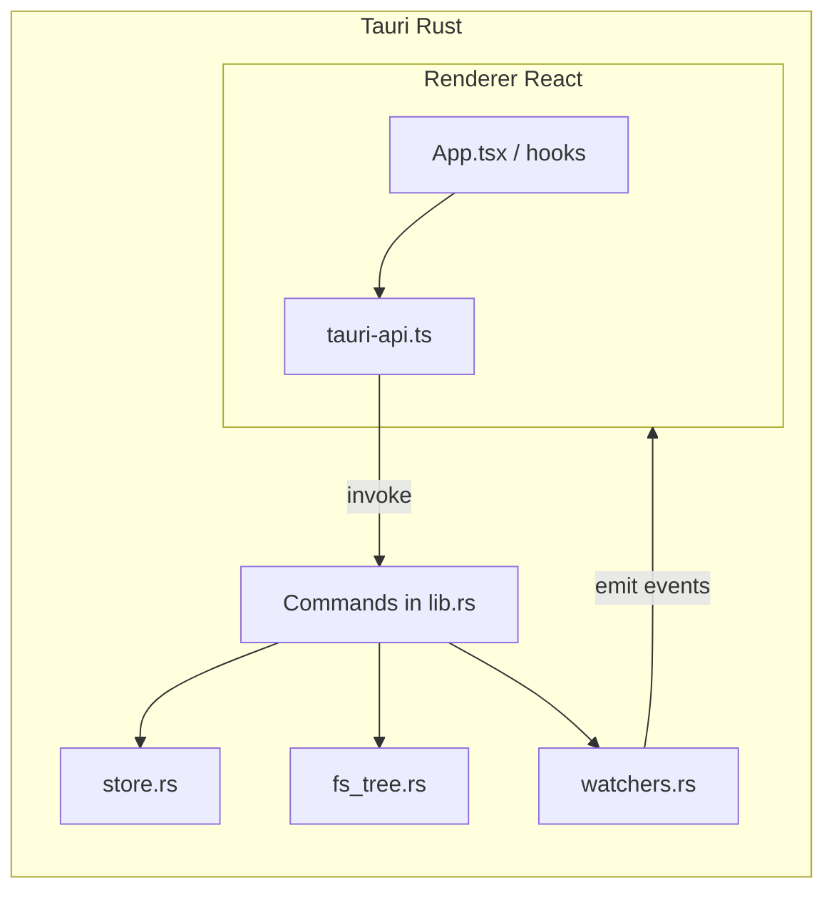

# Tauri v2 Migration Implementation Plan

> **For agentic workers:** REQUIRED SUB-SKILL: Use superpowers:subagent-driven-development (recommended) or superpowers:executing-plans to implement this plan task-by-task. Steps use checkbox (`- [ ]`) syntax for tracking.

**Goal:** Add a runnable Tauri v2 shell alongside the existing Electron desktop app so the React renderer can be exercised under Tauri without breaking Electron. Deliver a first spike where `pnpm run --filter desktop tauri:dev` opens files/folders, renders markdown, persists settings/recents, and receives file/folder watcher events.

**Architecture:** Side-by-side migration. Keep Electron main/preload/renderer intact. Add `apps/desktop/src-tauri/` (Rust backend) and a renderer-side `window.api` bridge (`tauri-api.ts`) that mirrors the existing `ElectronAPI` contract from `src/preload/index.ts`. The renderer stays unchanged except for a small bootstrap hook that installs `window.api` when `__TAURI_INTERNALS__` is present. Electron is removed only after Tauri reaches feature parity.

**Tech Stack:** Tauri v2, Rust 1.93, `@tauri-apps/cli` 2.x, `@tauri-apps/api` 2.x, plugins (`dialog`, `opener`, `store` or custom JSON store), `notify` (file watching), existing Vite/React 19 renderer, Vitest for TS tests, `cargo test` for Rust unit tests.

**Branch:** `tauri-migration-spike`

**Local toolchain (verified):** rustc 1.93.0, cargo 1.93.0, pnpm 11.1.3

---

## Architecture Decision

### Side-by-side, not replace-in-place

| Concern                 | Decision                                                          | Rationale                                                                   |
| ----------------------- | ----------------------------------------------------------------- | --------------------------------------------------------------------------- |
| Electron removal timing | Defer until Tauri spike + parity phase complete                   | Keeps `pnpm run dev` working for daily use; reduces migration risk          |
| Renderer reuse          | 100% — same React app, same Zustand/TanStack Query                | Markdown pipeline (comark/shiki/mermaid) already works in WebView           |
| Native API surface      | Preserve `window.api: ElectronAPI` shape                          | 20+ renderer call sites; bridge avoids mass refactor                        |
| Build tooling           | Separate Vite config for Tauri frontend (`vite.config.tauri.ts`)  | electron-vite is Electron-specific; Tauri needs plain Vite + `frontendDist` |
| File watching           | Rust `notify` crate, not chokidar                                 | chokidar is Node-only; Rust watcher mirrors debounce semantics              |
| Persistent store        | Rust JSON store in app data dir (mirror electron-store schema)    | Keeps recents/settings compatible; can share file path pattern later        |
| Native menu             | Defer to Phase 2; spike uses existing renderer keyboard shortcuts | Menu events already duplicated by `useAppKeyboardShortcuts`                 |
| Auto-updater            | No-op stubs in spike                                              | Match updater IPC contract; wire `tauri-plugin-updater` in follow-up        |
| Window chrome           | Standard Tauri title bar in spike                                 | `TitlebarInset` already no-ops on non-Mac; revisit hidden inset later       |

### Data flow (spike)



### Electron vs Tauri runtime selection

```typescript
// apps/desktop/src/renderer/src/main.tsx (after change)
import { installNativeApi } from '@renderer/lib/native-api'
installNativeApi() // sets window.api from preload (Electron) or tauri-api (Tauri)
```

Detection logic lives in `native-api.ts`:

- If `window.api` already exists (Electron preload ran first) → no-op
- Else if `__TAURI_INTERNALS__` in `globalThis` → install `createTauriApi()`
- Else (Vitest/jsdom) → leave undefined; tests use `stubWindowApi`

---

## File Map

### New — Tauri backend (`apps/desktop/src-tauri/`)

| File                        | Responsibility                                                                 |
| --------------------------- | ------------------------------------------------------------------------------ |
| `Cargo.toml`                | Crate deps: tauri 2, serde, notify, tokio, dirs, thiserror                     |
| `build.rs`                  | Standard Tauri build script                                                    |
| `tauri.conf.json`           | App identity, dev/build hooks, window config, bundle identifiers               |
| `capabilities/default.json` | Tauri v2 permissions for dialog, fs read, events, opener                       |
| `src/main.rs`               | Binary entry; calls `mdow_lib::run()`                                          |
| `src/lib.rs`                | `run()`, command registration, event emitters, app setup                       |
| `src/models.rs`             | Shared Serde types: `TreeNode`, `ScanResult`, `FileResult`, `AppState`, errors |
| `src/store.rs`              | JSON persistence mirroring `apps/desktop/src/main/store.ts`                    |
| `src/fs_tree.rs`            | Folder scan (port of `folder-service.ts` scan logic)                           |
| `src/watchers.rs`           | File + folder watchers (port of chokidar debounce behavior)                    |

### New — Renderer bridge

| File                                 | Responsibility                                                           |
| ------------------------------------ | ------------------------------------------------------------------------ |
| `src/shared/api-types.ts`            | Shared TS types extracted from preload (`ElectronAPI`, `AppState`, etc.) |
| `src/renderer/src/lib/tauri-api.ts`  | `createTauriApi(): ElectronAPI` using `invoke` + `listen`                |
| `src/renderer/src/lib/native-api.ts` | Runtime detection + `installNativeApi()`                                 |
| `src/renderer/src/lib/is-tauri.ts`   | `export const isTauri = () => '__TAURI_INTERNALS__' in globalThis`       |

### New — Frontend build for Tauri

| File                   | Responsibility                                                                              |
| ---------------------- | ------------------------------------------------------------------------------------------- |
| `vite.config.tauri.ts` | Vite config: React, Tailwind, `@renderer` alias, `root: src/renderer`, `outDir: dist-tauri` |

### Modified — Existing files (minimal)

| File                                     | Change                                                               |
| ---------------------------------------- | -------------------------------------------------------------------- |
| `apps/desktop/package.json`              | Add Tauri deps + scripts (`tauri:dev`, `tauri:build`, `cargo:check`) |
| `apps/desktop/src/preload/index.ts`      | Re-export types from `src/shared/api-types.ts` (no behavior change)  |
| `apps/desktop/src/preload/env.d.ts`      | Import `ElectronAPI` from shared types                               |
| `apps/desktop/src/renderer/src/main.tsx` | Call `installNativeApi()` before React render                        |
| `apps/desktop/.gitignore`                | Ignore `dist-tauri/`, `src-tauri/target/`                            |
| `turbo.json`                             | Add `tauri:dev` (persistent, no cache), optional `cargo:check` task  |

### Unchanged in spike (Electron stays)

| Path                              | Notes                                      |
| --------------------------------- | ------------------------------------------ |
| `src/main/**`                     | Electron main process — untouched          |
| `src/preload/index.ts` IPC wiring | Still used by `pnpm run dev`               |
| `electron.vite.config.ts`         | Electron dev/build unchanged               |
| Renderer components/hooks         | No direct Tauri imports; only `window.api` |

---

## API Contract Mapping (Electron IPC → Tauri)

Complete mapping the bridge must implement for the spike:

| `window.api` method     | Electron IPC              | Tauri implementation                                                 |
| ----------------------- | ------------------------- | -------------------------------------------------------------------- |
| `platform`              | `process.platform`        | `type()` from `@tauri-apps/plugin-os` or compile-time cfg in command |
| `openFileDialog`        | `file:open-dialog`        | `dialog.open` + `read_file` command                                  |
| `readFile`              | `file:read`               | `read_file` command + start file watcher                             |
| `unwatchFile`           | `file:unwatch`            | `unwatch_file` command                                               |
| `openFolderDialog`      | `folder:open-dialog`      | `dialog.open(directory)` + `scan_folder`                             |
| `readFolderTree`        | `folder:read-tree`        | `scan_folder` command + start folder watcher                         |
| `getRecents`            | `store:get-recents`       | `store_get_recents`                                                  |
| `getAppState`           | `store:get-state`         | `store_get_state`                                                    |
| `saveAppState`          | `store:save-state`        | `store_save_state`                                                   |
| `addRecent`             | `store:add-recent`        | `store_add_recent`                                                   |
| `showInFolder`          | `shell:show-in-folder`    | `opener.revealItemInDir`                                             |
| `setWindowTitle`        | `window:set-title`        | `getCurrentWindow().setTitle()`                                      |
| `closeWindow`           | `window:close`            | `getCurrentWindow().close()`                                         |
| `setTheme`              | `theme:set`               | Save theme + emit `theme:changed` (CSS class via renderer)           |
| `getPathForFile`        | `webUtils.getPathForFile` | Tauri drag-drop paths or `@tauri-apps/api/path` helper               |
| `onFileChanged`         | `file:changed` event      | `listen('file:changed', ...)`                                        |
| `onFileDeleted`         | `file:deleted` event      | `listen('file:deleted', ...)`                                        |
| `onFolderChanged`       | `folder:changed` event    | `listen('folder:changed', ...)`                                      |
| `onThemeChanged`        | `theme:changed` event     | `listen('theme:changed', ...)`                                       |
| `onFileOpened`          | `file:opened` event       | `listen('file:opened', ...)` + CLI/deep-link handler                 |
| `onMenu*` (12 handlers) | `menu:*` events           | **Spike:** no-op unsubscribes OR emit from deferred menu plugin      |
| `checkForUpdates` etc.  | `updater:*`               | **Spike:** resolved no-op promises                                   |
| `onUpdate*` events      | `updater:*` events        | **Spike:** no-op unsubscribes                                        |

### Folder scan parity constants (must match `folder-service.ts`)

```rust
// src/fs_tree.rs
const MD_EXTENSIONS: &[&str] = &[".md", ".markdown", ".mdx"];
const IGNORED_DIRS: &[&str] = &[
    "node_modules", "dist", "out", "build", "target",
    ".next", ".turbo", "coverage",
];
const MAX_FILES: usize = 5000;
const MAX_DEPTH: u32 = 8;
// Sort: directories first, then locale-aware name compare
// Skip dot-prefixed entries
// Return ScanResult { tree, truncated }
```

---

## Spike Definition (Definition of Done)

The spike is complete when **all** of the following pass:

1. **Launch:** `pnpm run --filter desktop tauri:dev` opens the Mdow window without Electron.
2. **Open file:** Welcome screen → Open File → pick `.md` → tab opens, markdown renders (headings, code blocks, mermaid).
3. **Open folder:** Open Folder → sidebar tree populates markdown files only, respects truncation banner if applicable.
4. **Recents:** Re-opened files appear in Recents; restart app → recents persist.
5. **App settings:** Sidebar width, zoom, fonts, theme choice persist across restart (`saveAppState` / `getAppState`).
6. **Session restore:** Open tabs restore on restart (best-effort read of session tab paths).
7. **File watcher:** Edit open file externally → tab content updates within ~500ms.
8. **Folder watcher:** Add/remove `.md` in watched folder → sidebar tree refreshes within ~2s.
9. **Drag-drop:** Drop a `.md` file onto the window → opens in a tab (Tauri drag-drop path).
10. **Keyboard shortcuts:** Cmd/Ctrl+O, Cmd/Ctrl+Shift+O, Cmd/Ctrl+F, etc. work via existing `useAppKeyboardShortcuts`.
11. **Updater:** Settings toggle for auto-update does not crash; check/install are no-ops.
12. **Electron unaffected:** `pnpm run --filter desktop dev` still launches Electron build.

---

## Task 1: Extract shared API types

**Files:**

- Create: `apps/desktop/src/shared/api-types.ts`
- Modify: `apps/desktop/src/preload/index.ts`
- Modify: `apps/desktop/src/preload/env.d.ts`

- [ ] **Step 1: Create shared types file**

Move interfaces from `preload/index.ts` into `src/shared/api-types.ts`:

```typescript
// apps/desktop/src/shared/api-types.ts
export interface FileResult {
  path: string
  content: string
}

export interface TreeNode {
  name: string
  path: string
  isDirectory: boolean
  children?: TreeNode[]
}

export interface ScanResult {
  tree: TreeNode[]
  truncated: boolean
}

export interface AppState {
  sidebarWidth: number
  zoomLevel: number
  lastFolder: string | null
  windowBounds: { x: number; y: number; width: number; height: number } | null
  sessionTabs: { path: string }[]
  sessionActiveTabPath: string | null
  contentFont: string
  codeFont: string
  fontSize: number
  lineHeight: number
  theme: string
  autoUpdateEnabled: boolean
}

export type Unsubscribe = () => void

export interface ElectronAPI {
  platform: NodeJS.Platform
  openFileDialog: () => Promise<FileResult | null>
  readFile: (path: string) => Promise<string>
  unwatchFile: (path: string) => Promise<void>
  openFolderDialog: () => Promise<{ path: string; tree: TreeNode[]; truncated: boolean } | null>
  readFolderTree: (folderPath: string) => Promise<ScanResult>
  getRecents: () => Promise<string[]>
  getAppState: () => Promise<AppState>
  saveAppState: (state: Partial<AppState>) => Promise<void>
  addRecent: (filePath: string) => Promise<void>
  showInFolder: (filePath: string) => Promise<void>
  setWindowTitle: (title: string, filePath?: string) => Promise<void>
  closeWindow: () => Promise<void>
  setTheme: (theme: string) => Promise<void>
  getPathForFile: (file: File) => string
  // ... all on* and updater methods (copy verbatim from preload/index.ts)
}
```

- [ ] **Step 2: Update preload to import shared types**

```typescript
// apps/desktop/src/preload/index.ts
import type { ElectronAPI, FileResult, TreeNode, ScanResult, AppState } from '../shared/api-types'
export type { FileResult, TreeNode, ScanResult, AppState, ElectronAPI } from '../shared/api-types'
// ... rest unchanged
```

- [ ] **Step 3: Update env.d.ts**

```typescript
import type { ElectronAPI } from '../shared/api-types'
declare global {
  interface Window {
    api: ElectronAPI
  }
}
```

**Verify:**

```bash
pnpm run --filter desktop typecheck
pnpm run --filter desktop test
```

**Expected:** All existing tests pass; zero renderer behavior change.

---

## Task 2: Scaffold Tauri project

**Files:**

- Create: `apps/desktop/src-tauri/` (via CLI, then customize)
- Modify: `apps/desktop/package.json`
- Modify: `apps/desktop/.gitignore`

- [ ] **Step 1: Install Tauri CLI and API packages**

```bash
cd apps/desktop
pnpm add -D @tauri-apps/cli@^2
pnpm add @tauri-apps/api@^2 @tauri-apps/plugin-dialog@^2 @tauri-apps/plugin-opener@^2 @tauri-apps/plugin-os@^2
```

- [ ] **Step 2: Initialize Tauri in desktop workspace**

```bash
cd apps/desktop
pnpm tauri init --ci \
  --app-name Mdow \
  --window-title Mdow \
  --frontend-dist ../dist-tauri \
  --dev-url http://localhost:5173 \
  --before-dev-command "pnpm run dev:web" \
  --before-build-command "pnpm run build:web"
```

If `--ci` flags differ in your CLI version, run interactively once and commit the generated skeleton, then adjust paths so `src-tauri` lives at `apps/desktop/src-tauri` (not repo root).

- [ ] **Step 3: Add package scripts**

```json
{
  "scripts": {
    "dev:web": "vite --config vite.config.tauri.ts",
    "build:web": "vite build --config vite.config.tauri.ts",
    "tauri:dev": "tauri dev",
    "tauri:build": "tauri build",
    "cargo:check": "cargo check --manifest-path src-tauri/Cargo.toml",
    "cargo:test": "cargo test --manifest-path src-tauri/Cargo.toml"
  }
}
```

- [ ] **Step 4: Update .gitignore**

```
dist-tauri/
src-tauri/target/
```

**Verify:**

```bash
pnpm run --filter desktop cargo:check
```

**Expected:** Empty Tauri app compiles (may fail until vite config exists — proceed to Task 3).

---

## Task 3: Create Vite config for Tauri frontend

**Files:**

- Create: `apps/desktop/vite.config.tauri.ts`

- [ ] **Step 1: Add vite.config.tauri.ts**

Mirror `electron.vite.config.ts` renderer settings:

```typescript
import { resolve } from 'path'
import { defineConfig } from 'vite'
import tailwindcss from '@tailwindcss/vite'
import react from '@vitejs/plugin-react'

export default defineConfig({
  root: resolve('src/renderer'),
  publicDir: resolve('src/renderer/public'),
  build: {
    outDir: resolve('dist-tauri'),
    emptyOutDir: true,
  },
  resolve: {
    alias: {
      '@renderer': resolve('src/renderer/src'),
    },
  },
  plugins: [tailwindcss(), react()],
  server: {
    port: 5173,
    strictPort: true,
  },
})
```

- [ ] **Step 2: Confirm index.html path**

Ensure `src/renderer/index.html` script src resolves (`/src/main.tsx` relative to renderer root).

- [ ] **Step 3: Smoke-test Vite alone**

```bash
pnpm run --filter desktop dev:web
```

Open http://localhost:5173 — expect blank/broken app (no `window.api` yet) but React mounts without crash.

**Expected:** Vite serves renderer; no Electron required.

---

## Task 4: Configure tauri.conf.json

**Files:**

- Modify: `apps/desktop/src-tauri/tauri.conf.json`
- Create: `apps/desktop/src-tauri/capabilities/default.json`

- [ ] **Step 1: Set tauri.conf.json**

```json
{
  "$schema": "https://schema.tauri.app/config/2",
  "productName": "Mdow",
  "version": "1.0.3",
  "identifier": "com.zainw.mdow",
  "build": {
    "beforeDevCommand": "pnpm run dev:web",
    "devUrl": "http://localhost:5173",
    "beforeBuildCommand": "pnpm run build:web",
    "frontendDist": "../dist-tauri"
  },
  "app": {
    "windows": [
      {
        "title": "Mdow",
        "width": 1000,
        "height": 700,
        "minWidth": 600,
        "minHeight": 400,
        "dragDropEnabled": true
      }
    ],
    "security": {
      "csp": null
    }
  },
  "bundle": {
    "icon": [
      "icons/32x32.png",
      "icons/128x128.png",
      "icons/128x128@2x.png",
      "icons/icon.icns",
      "icons/icon.ico"
    ]
  }
}
```

Copy icons from `apps/desktop/resources/` into `src-tauri/icons/` using `pnpm tauri icon apps/desktop/resources/icon.png` or manual copy.

- [ ] **Step 2: Create capabilities/default.json**

```json
{
  "$schema": "https://schema.tauri.app/config/2/capability",
  "identifier": "default",
  "description": "Mdow default permissions",
  "windows": ["main"],
  "permissions": [
    "core:default",
    "core:event:default",
    "core:window:default",
    "core:window:allow-set-title",
    "core:window:allow-close",
    "dialog:default",
    "dialog:allow-open",
    "opener:default",
    "opener:allow-reveal-item-in-dir"
  ]
}
```

Add explicit path read scopes if using Tauri fs plugin later; for spike, file reads happen in Rust commands (no scoped FS plugin needed).

- [ ] **Step 3: Register plugins in lib.rs** (see Task 6)

**Verify:**

```bash
pnpm run --filter desktop tauri:dev
```

**Expected:** Window opens loading Vite dev URL (may error on missing commands — OK at this stage).

---

## Task 5: Rust models and store

**Files:**

- Create: `apps/desktop/src-tauri/src/models.rs`
- Create: `apps/desktop/src-tauri/src/store.rs`

- [ ] **Step 1: Define models.rs**

```rust
use serde::{Deserialize, Serialize};

#[derive(Debug, Clone, Serialize, Deserialize)]
pub struct TreeNode {
    pub name: String,
    pub path: String,
    pub is_directory: bool,
    #[serde(skip_serializing_if = "Option::is_none")]
    pub children: Option<Vec<TreeNode>>,
}

#[derive(Debug, Clone, Serialize, Deserialize)]
pub struct ScanResult {
    pub tree: Vec<TreeNode>,
    pub truncated: bool,
}

#[derive(Debug, Clone, Serialize, Deserialize)]
pub struct FileResult {
    pub path: String,
    pub content: String,
}

#[derive(Debug, Clone, Serialize, Deserialize)]
pub struct SessionTab {
    pub path: String,
}

#[derive(Debug, Clone, Serialize, Deserialize)]
pub struct WindowBounds {
    pub x: i32,
    pub y: i32,
    pub width: u32,
    pub height: u32,
}

#[derive(Debug, Clone, Serialize, Deserialize)]
pub struct AppState {
    pub sidebar_width: u32,
    pub zoom_level: u32,
    pub last_folder: Option<String>,
    pub window_bounds: Option<WindowBounds>,
    pub session_tabs: Vec<SessionTab>,
    pub session_active_tab_path: Option<String>,
    pub content_font: String,
    pub code_font: String,
    pub font_size: f64,
    pub line_height: f64,
    pub theme: String,
    pub auto_update_enabled: bool,
}

#[derive(Debug, Clone, Serialize, Deserialize, Default)]
pub struct StoreSchema {
    #[serde(default)]
    pub recents: Vec<String>,
    #[serde(default)]
    pub last_folder: Option<String>,
    // ... mirror all StoreSchema fields from store.ts with serde defaults
}
```

Use `#[serde(rename_all = "camelCase")]` on structs returned to JS.

- [ ] **Step 2: Implement store.rs**

Key functions (exact signatures):

```rust
pub struct AppStore {
    path: PathBuf,
    data: Mutex<StoreSchema>,
}

impl AppStore {
    pub fn load(app_handle: &AppHandle) -> Result<Self, StoreError>;
    pub fn get_recents(&self) -> Vec<String>;
    pub fn add_recent(&self, file_path: &str);
    pub fn get_app_state(&self) -> AppState;
    pub fn save_app_state(&self, patch: serde_json::Value) -> Result<(), StoreError>;
    pub fn set_last_folder(&self, folder: Option<&str>);
}
```

Storage path: `{app_data_dir}/mdow/store.json` via `app_handle.path().app_data_dir()`.

Defaults (must match `apps/desktop/src/main/store.ts`):

```rust
fn default_schema() -> StoreSchema {
    StoreSchema {
        recents: vec![],
        last_folder: None,
        sidebar_width: 260,
        zoom_level: 100,
        window_bounds: None,
        session_tabs: vec![],
        session_active_tab_path: None,
        content_font: "inter".into(),
        code_font: "geist-mono".into(),
        font_size: 15.5,
        line_height: 1.65,
        theme: "system".into(),
        auto_update_enabled: true,
    }
}
```

Persist on every mutating call (simple spike; optimize later).

- [ ] **Step 3: Add store unit tests**

```rust
#[cfg(test)]
mod tests {
    #[test]
    fn add_recent_moves_to_front_and_caps_at_20() { /* ... */ }

    #[test]
    fn save_app_state_partial_patch() { /* ... */ }
}
```

**Verify:**

```bash
pnpm run --filter desktop cargo:test
```

**Expected:** Store tests pass; JSON file format uses camelCase keys for JS interop.

---

## Task 6: Rust filesystem tree scanner

**Files:**

- Create: `apps/desktop/src-tauri/src/fs_tree.rs`

- [ ] **Step 1: Port scan logic from folder-service.ts**

Public API:

```rust
pub fn scan_folder(folder_path: &Path) -> Result<ScanResult, FsError>;
```

Behavior:

- Recursive read with `MAX_DEPTH = 8`
- Skip dotfiles/dotdirs and `IGNORED_DIRS`
- Include only markdown extensions
- Increment file count; set `truncated = true` when count >= 5000
- Sort entries: directories first, then `name.cmp` (locale-aware if easy; `Ord` acceptable for spike)
- Directory nodes only included if they have markdown descendants

- [ ] **Step 2: Add fs_tree unit tests**

Test fixtures in `src-tauri/tests/fixtures/tree/`:

```
tree/
  docs/
    a.md
    b.mdx
  node_modules/   # ignored
    x.md
  .hidden/
    c.md          # ignored
```

**Verify:**

```bash
pnpm run --filter desktop cargo:test
```

**Expected:** Scan output matches Electron `folder-service.test.ts` expectations (port test cases).

---

## Task 7: Rust file/folder watchers

**Files:**

- Create: `apps/desktop/src-tauri/src/watchers.rs`

- [ ] **Step 1: Implement WatcherState**

```rust
pub struct WatcherHub {
    file_watchers: Mutex<HashMap<String, FileWatchHandle>>,
    folder_watcher: Mutex<Option<FolderWatchHandle>>,
}

impl WatcherHub {
    pub fn watch_file(&self, app: AppHandle, path: PathBuf);
    pub fn unwatch_file(&self, path: &str);
    pub fn watch_folder(&self, app: AppHandle, path: PathBuf);
    pub fn unwatch_folder(&self);
    pub fn unwatch_all(&self);
}
```

- [ ] **Step 2: File watcher behavior**

- Debounce 300ms on write (match `file-service.ts`)
- On change: re-read file, emit `file:changed` with `{ path, content }`
- On delete: emit `file:deleted` with path string
- Use `notify` crate with recommended backend

- [ ] **Step 3: Folder watcher behavior**

- Debounce 1000ms (match `folder-service.ts`)
- On markdown add/remove or dir change: re-scan, emit `folder:changed` with `ScanResult`
- Ignore dot dirs and `IGNORED_DIRS` in notify filter

- [ ] **Step 4: Wire emits through AppHandle**

```rust
app.emit("file:changed", payload)?;
app.emit("folder:changed", scan_result)?;
```

**Verify:** Covered by manual smoke test in Task 11; optional watcher unit tests with temp dirs.

---

## Task 8: Tauri commands and app setup

**Files:**

- Create: `apps/desktop/src-tauri/src/lib.rs`
- Create: `apps/desktop/src-tauri/src/main.rs`
- Modify: `apps/desktop/src-tauri/Cargo.toml`

- [ ] **Step 1: Cargo.toml dependencies**

```toml
[package]
name = "mdow"
version = "1.0.3"
edition = "2021"

[lib]
name = "mdow_lib"
crate-type = ["lib", "cdylib", "staticlib"]

[build-dependencies]
tauri-build = { version = "2", features = [] }

[dependencies]
tauri = { version = "2", features = [] }
tauri-plugin-dialog = "2"
tauri-plugin-opener = "2"
tauri-plugin-os = "2"
serde = { version = "1", features = ["derive"] }
serde_json = "1"
thiserror = "2"
notify = "8"
tokio = { version = "1", features = ["time", "sync"] }
dirs = "6"

[features]
default = ["custom-protocol"]
custom-protocol = ["tauri/custom-protocol"]
```

- [ ] **Step 2: Command list to register in lib.rs**

```rust
#[tauri::command]
async fn read_file(path: String, state: State<'_, AppStateHandle>) -> Result<String, CommandError>;

#[tauri::command]
async fn open_file_dialog(app: AppHandle, state: State<'_, AppStateHandle>) -> Result<Option<FileResult>, CommandError>;

#[tauri::command]
async fn open_folder_dialog(app: AppHandle, state: State<'_, AppStateHandle>) -> Result<Option<OpenFolderResult>, CommandError>;

#[tauri::command]
async fn scan_folder_cmd(folder_path: String, state: State<'_, AppStateHandle>) -> Result<ScanResult, CommandError>;

#[tauri::command]
fn unwatch_file(path: String, watchers: State<'_, WatcherHub>);

#[tauri::command]
fn store_get_recents(store: State<'_, AppStore>) -> Vec<String>;

#[tauri::command]
fn store_get_state(store: State<'_, AppStore>) -> models::AppState;

#[tauri::command]
fn store_save_state(store: State<'_, AppStore>, patch: serde_json::Value) -> Result<(), CommandError>;

#[tauri::command]
fn store_add_recent(store: State<'_, AppStore>, file_path: String);

#[tauri::command]
async fn set_window_title(title: String, window: Window);

#[tauri::command]
async fn close_window(window: Window);

#[tauri::command]
async fn set_theme(theme: String, app: AppHandle, store: State<'_, AppStore>) -> Result<(), CommandError>;

#[tauri::command]
fn platform() -> String;

// Updater no-ops
#[tauri::command]
async fn updater_check() -> Result<(), ()> { Ok(()) }
#[tauri::command]
async fn updater_download() -> Result<(), ()> { Ok(()) }
#[tauri::command]
async fn updater_install() -> Result<(), ()> { Ok(()) }
#[tauri::command]
async fn updater_set_scheduling(_enabled: bool) -> Result<(), ()> { Ok(()) }
```

- [ ] **Step 3: App setup in run()**

```rust
pub fn run() {
    tauri::Builder::default()
        .plugin(tauri_plugin_dialog::init())
        .plugin(tauri_plugin_opener::init())
        .plugin(tauri_plugin_os::init())
        .setup(|app| {
            let store = AppStore::load(app.handle())?;
            app.manage(store);
            app.manage(WatcherHub::default());
            // Restore theme: emit theme:changed based on store + system preference
            Ok(())
        })
        .invoke_handler(tauri::generate_handler![
            read_file,
            open_file_dialog,
            // ... all commands
        ])
        .run(tauri::generate_context!())
        .expect("error while running tauri application");
}
```

- [ ] **Step 4: open_file_dialog implementation sketch**

```rust
use tauri_plugin_dialog::DialogExt;

let path = app.dialog()
    .file()
    .add_filter("Markdown", &["md", "markdown", "mdx"])
    .blocking_pick_file();

if let Some(path) = path {
    let path_str = path.to_string_lossy().to_string();
    let content = std::fs::read_to_string(&path)?;
    store.add_recent(&path_str);
    watchers.watch_file(app.clone(), PathBuf::from(&path_str));
    Ok(Some(FileResult { path: path_str, content }))
} else {
    Ok(None)
}
```

- [ ] **Step 5: read_file error mapping**

Map `NotFound` → JS Error message `not-found`, `PermissionDenied` → `permission-denied` (match Electron `ipc.ts` behavior that renderer expects).

- [ ] **Step 6: main.rs**

```rust
fn main() {
    mdow_lib::run();
}
```

- [ ] **Step 7: build.rs**

Standard:

```rust
fn main() {
    tauri_build::build()
}
```

**Verify:**

```bash
pnpm run --filter desktop cargo:check
pnpm run --filter desktop cargo:test
```

---

## Task 9: Renderer Tauri API bridge

**Files:**

- Create: `apps/desktop/src/renderer/src/lib/is-tauri.ts`
- Create: `apps/desktop/src/renderer/src/lib/tauri-api.ts`
- Create: `apps/desktop/src/renderer/src/lib/native-api.ts`
- Modify: `apps/desktop/src/renderer/src/main.tsx`

- [ ] **Step 1: is-tauri.ts**

```typescript
export function isTauri(): boolean {
  return typeof globalThis !== 'undefined' && '__TAURI_INTERNALS__' in globalThis
}
```

- [ ] **Step 2: Implement createTauriApi()**

```typescript
import { invoke } from '@tauri-apps/api/core'
import { listen, type UnlistenFn } from '@tauri-apps/api/event'
import { getCurrentWindow } from '@tauri-apps/api/window'
import { revealItemInDir } from '@tauri-apps/plugin-opener'
import type { ElectronAPI, Unsubscribe } from '../../../shared/api-types'

function subscribe<T>(event: string, callback: (payload: T) => void): Unsubscribe {
  let unlisten: UnlistenFn | null = null
  void listen<T>(event, (e) => callback(e.payload)).then((fn) => {
    unlisten = fn
  })
  return () => {
    void unlisten?.()
  }
}

const noopUnsub = (): void => {}

export function createTauriApi(): ElectronAPI {
  return {
    platform: 'darwin' as NodeJS.Platform, // override via invoke('platform') async if needed
    openFileDialog: () => invoke('open_file_dialog'),
    readFile: (path) => invoke('read_file', { path }),
    unwatchFile: (path) => invoke('unwatch_file', { path }),
    openFolderDialog: () => invoke('open_folder_dialog'),
    readFolderTree: (folderPath) => invoke('scan_folder_cmd', { folderPath }),
    getRecents: () => invoke('store_get_recents'),
    getAppState: () => invoke('store_get_state'),
    saveAppState: (state) => invoke('store_save_state', { patch: state }),
    addRecent: (filePath) => invoke('store_add_recent', { filePath }),
    showInFolder: (filePath) => revealItemInDir(filePath),
    setWindowTitle: (title) => getCurrentWindow().setTitle(title),
    closeWindow: () => getCurrentWindow().close(),
    setTheme: (theme) => invoke('set_theme', { theme }),
    getPathForFile: (file) => {
      // Tauri WebView may expose file.path; fallback to name-only (drag-drop uses separate handler)
      return (file as File & { path?: string }).path ?? file.name
    },

    onFileChanged: (cb) => subscribe('file:changed', cb),
    onFileDeleted: (cb) => subscribe<string>('file:deleted', cb),
    onFolderChanged: (cb) => subscribe('folder:changed', cb),
    onThemeChanged: (cb) => subscribe<boolean>('theme:changed', cb),
    onFileOpened: (cb) => subscribe('file:opened', cb),

    // Spike: menu events unused (keyboard shortcuts cover core actions)
    onMenuOpenFile: () => noopUnsub,
    onMenuOpenFolder: () => noopUnsub,
    onMenuFind: () => noopUnsub,
    onMenuToggleSidebar: () => noopUnsub,
    onMenuZoomIn: () => noopUnsub,
    onMenuZoomOut: () => noopUnsub,
    onMenuZoomReset: () => noopUnsub,
    onMenuShortcuts: () => noopUnsub,
    onMenuSettings: () => noopUnsub,
    onMenuCloseTab: () => noopUnsub,
    onMenuCheckForUpdates: () => noopUnsub,

    checkForUpdates: async () => {},
    downloadUpdate: async () => {},
    installUpdate: async () => {},
    setAutoUpdateScheduling: async () => {},
    onUpdateAvailable: () => noopUnsub,
    onUpdateUpToDate: () => noopUnsub,
    onUpdateDownloadProgress: () => noopUnsub,
    onUpdateDownloaded: () => noopUnsub,
    onUpdateError: () => noopUnsub,
  }
}
```

- [ ] **Step 3: native-api.ts**

```typescript
import { isTauri } from './is-tauri'
import { createTauriApi } from './tauri-api'

export function installNativeApi(): void {
  if (typeof window === 'undefined') return
  if (window.api) return // Electron preload already set
  if (isTauri()) {
    window.api = createTauriApi()
  }
}
```

- [ ] **Step 4: Bootstrap in main.tsx**

```typescript
import { installNativeApi } from '@renderer/lib/native-api'

installNativeApi()

ReactDOM.createRoot(document.getElementById('root')!).render(/* ... */)
```

- [ ] **Step 5: Tauri drag-drop for getPathForFile parity**

In `lib.rs` setup, listen to window drag-drop:

```rust
window.on_drag_drop_event(|event| {
    if let DragDropEvent::Drop { paths, .. } = event {
        for path in paths {
            if is_markdown(&path) {
                // read + emit file:opened
            }
        }
    }
});
```

Prefer this over broken `getPathForFile` for Tauri.

**Verify:**

```bash
pnpm run --filter desktop typecheck
pnpm run --filter desktop tauri:dev
```

**Expected:** App initializes (`initialized: true`), no `window.api` undefined errors.

---

## Task 10: Theme and platform polish

**Files:**

- Modify: `apps/desktop/src-tauri/src/lib.rs` (set_theme command)
- Modify: `apps/desktop/src/renderer/src/lib/tauri-api.ts` (platform detection)

- [ ] **Step 1: set_theme command**

Save to store; determine dark/light:

```rust
fn resolve_is_dark(theme: &str) -> bool {
    match theme {
        "dark" => true,
        "light" => false,
        _ => /* read system preference via dark-light crate or tauri-plugin-os */,
    }
}
app.emit("theme:changed", resolve_is_dark(&theme))?;
```

- [ ] **Step 2: platform command**

Return `std::env::consts::OS` mapped to `darwin`/`win32`/`linux` strings Node uses.

- [ ] **Step 3: Emit initial theme on app load**

In setup, after store load, emit `theme:changed` so `useTheme` syncs.

**Verify:** Toggle theme in Settings → document class updates; restart persists.

---

## Task 11: Spike smoke test (manual checklist)

- [ ] **Step 1: Launch**

```bash
pnpm run --filter desktop tauri:dev
```

- [ ] **Step 2: File open flow**

Open `README.md` or any `.md` → verify rendered output, tab title, breadcrumb.

- [ ] **Step 3: Folder open flow**

Open repo root or `docs/` → sidebar lists markdown files, dirs expandable.

- [ ] **Step 4: Persistence**

Change zoom/settings, open files, restart → state restored.

- [ ] **Step 5: File watcher**

With file open, edit in external editor, save → tab refreshes.

- [ ] **Step 6: Folder watcher**

With folder open, create `new-note.md` → appears in tree after debounce.

- [ ] **Step 7: Electron regression**

```bash
pnpm run --filter desktop dev
```

Confirm Electron still works.

---

## Task 12: Automated verification

- [ ] **Step 1: TypeScript checks**

```bash
pnpm run --filter desktop typecheck
pnpm run --filter desktop lint
pnpm run --filter desktop fmt:check
pnpm run --filter desktop test
```

- [ ] **Step 2: Rust checks**

```bash
pnpm run --filter desktop cargo:check
pnpm run --filter desktop cargo:test
```

- [ ] **Step 3: Tauri production build (optional for spike)**

```bash
pnpm run --filter desktop tauri:build
```

**Expected:** All TS tests pass (no Tauri env in Vitest). Rust tests pass. `tauri:build` produces platform bundle.

---

## Task 13: Turbo integration (optional but recommended)

**Files:**

- Modify: `turbo.json`
- Modify: root `package.json` (if adding root script alias)

- [ ] **Step 1: Add turbo tasks**

```json
{
  "tauri:dev": {
    "cache": false,
    "persistent": true
  },
  "cargo:check": {
    "inputs": ["src-tauri/**"]
  },
  "cargo:test": {
    "inputs": ["src-tauri/**"]
  }
}
```

- [ ] **Step 2: Root convenience script**

```json
"tauri:dev": "pnpm run --filter desktop tauri:dev"
```

---

## Risks and Mitigations

| Risk                                                | Impact                                     | Mitigation                                                                                   |
| --------------------------------------------------- | ------------------------------------------ | -------------------------------------------------------------------------------------------- |
| `window.api` shape drift                            | Renderer runtime errors                    | Single source of truth in `src/shared/api-types.ts`; typecheck both bridges                  |
| Tauri drag-drop paths differ by OS                  | Drop-to-open broken on Linux               | Use Tauri drag-drop event in Rust; add e2e test later                                        |
| `notify` recursive watch performance on large repos | UI jank                                    | Reuse MAX_FILES/MAX_DEPTH; debounce folder rescans (1000ms)                                  |
| Separate store files (Electron vs Tauri)            | Settings don't sync when switching runtime | Accept for spike; Phase 2 can unify path or migrate data                                     |
| No native menu in spike                             | Menu bar items missing on Tauri            | Keyboard shortcuts cover main actions; add `tauri-plugin-menu` in Phase 2                    |
| Window bounds / session not restored in Tauri       | UX gap vs Electron                         | `window_bounds` saved but only applied when Tauri window-state plugin added                  |
| Single-instance / CLI open-file                     | Double-instance on macOS                   | Add `tauri-plugin-single-instance` in Phase 2                                                |
| Code signing / notarization                         | Can't ship Tauri macOS build               | Follow-up; spike is dev-only                                                                 |
| Mermaid/shiki CSP                                   | Diagrams blocked in prod build             | Set CSP null in dev; configure `dangerousDisableAssetCspModification` or inline CSP for prod |
| Vitest doesn't cover Tauri bridge                   | Bridge regressions                         | Add unit tests for `createTauriApi` with mocked `invoke`/`listen`                            |

---

## Follow-up Phases (post-spike)

### Phase 2 — Parity

- [ ] Native app menu via `tauri-plugin-menu` emitting existing `menu:*` events
- [ ] `tauri-plugin-window-state` for bounds restore
- [ ] `tauri-plugin-single-instance` + argv file open → `file:opened`
- [ ] macOS hidden title bar + `TitlebarInset` parity
- [ ] Unify persistence: migrate `electron-store` JSON into Tauri store path
- [ ] `@tauri-apps/plugin-updater` replacing electron-updater (Win/Linux); Mac → open releases page

### Phase 3 — CI & distribution

- [ ] GitHub Actions: `tauri build` matrix (mac/win/linux)
- [ ] Replace/complement electron-builder artifacts in releases
- [ ] Homebrew cask update script for Tauri `.dmg`/`.app`
- [ ] Update website download links

### Phase 4 — Remove Electron

- [ ] Delete `src/main/`, `src/preload/`, `electron.vite.config.ts`, `electron-builder.yml`
- [ ] Remove Electron deps from `package.json`
- [ ] Rename `dev:web` → `dev`, `build:web` → `build`
- [ ] Update `CLAUDE.md` / `AGENTS.md` architecture section
- [ ] Remove `postinstall` electron-builder hook

---

## Command Reference (quick copy)

```bash
# Spike dev
pnpm run --filter desktop tauri:dev

# Electron regression
pnpm run --filter desktop dev

# Verification suite
pnpm run --filter desktop typecheck
pnpm run --filter desktop lint
pnpm run --filter desktop test
pnpm run --filter desktop cargo:check
pnpm run --filter desktop cargo:test
pnpm run --filter desktop tauri:build

# Full monorepo verify (from repo skill)
pnpm run typecheck && pnpm run lint && pnpm run fmt:check && pnpm run test
```

---

## Implementation Order Summary

1. Task 1 — Shared API types (zero behavior change)
2. Task 2 — Tauri scaffold + package scripts
3. Task 3 — Vite config for Tauri
4. Task 4 — tauri.conf.json + capabilities
5. Task 5 — Rust store
6. Task 6 — Rust fs_tree
7. Task 7 — Rust watchers
8. Task 8 — Commands + lib.rs wiring
9. Task 9 — tauri-api.ts bridge + main.tsx bootstrap
10. Task 10 — Theme/platform polish
11. Task 11 — Manual spike smoke test
12. Task 12 — Automated verification
13. Task 13 — Turbo integration

**Estimated spike effort:** 1–2 focused agent sessions (Tasks 1–11).
